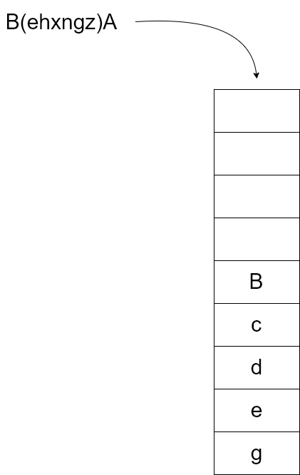
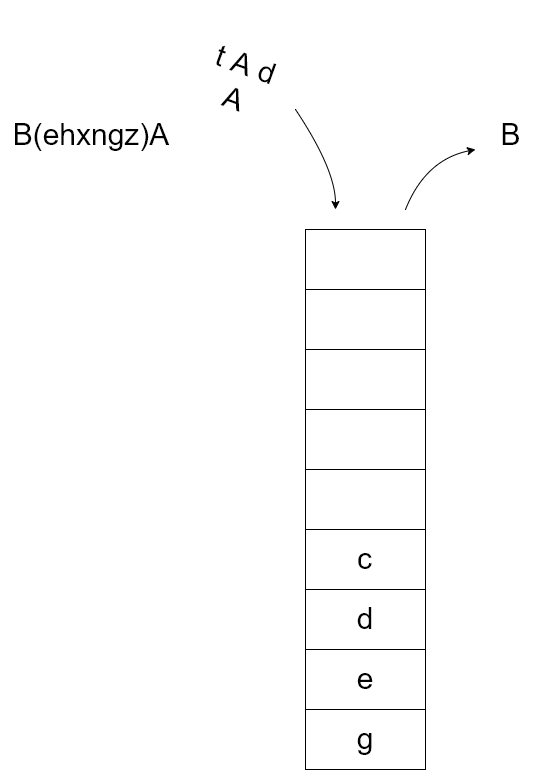
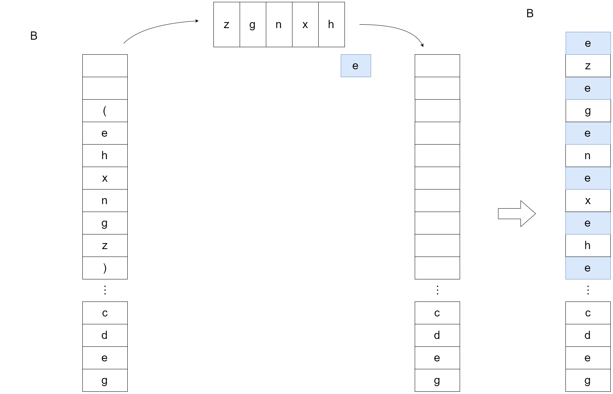
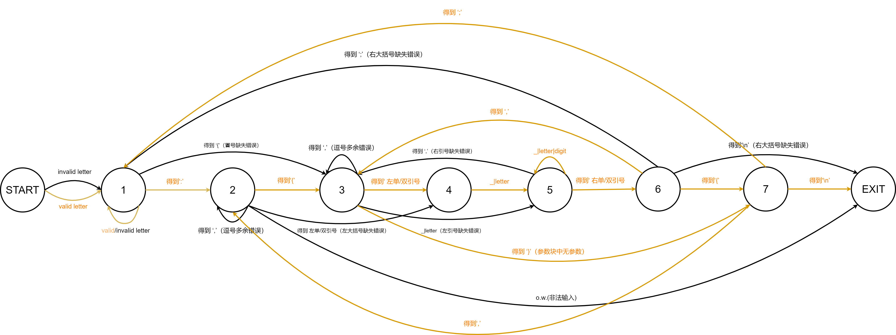

# 实验二 栈和队列

PB17111623

范睿

## 魔王语言解释

### 实验要求

__基本要求：__


__附加内容：__


### 实验内容

实现思路：

1. 输入字符从末尾开始往前依次入栈(Push)

​	

2. 每Push一个字符，就调用ProcessTop一次。ProcessTop每次都处理栈顶元素。
   * 栈顶为小写字母，直接返回
   
   * 栈顶为大写字母A/B/新规则左侧的字符，将其产生式右部从右往左依次入栈。
   
     
   
   * 栈顶为右括号，设置标志位Queue_flag为有效，开始计算括号内字符个数。
   
     当Queue_flag有效时，ProcessTop不处理任何字符。
   
   * 栈顶为左括号（说明两括号内部元素已经全部入栈），记录左括号弹出后的栈顶元素为e，Queue_flag取消，依次出栈直到右括号出栈，将所有出栈的字符入队。再将队列中元素依次出队，按照入栈一个e，入栈一个出队元素，入栈一个e，入栈一个出队元素的顺序将所有元素再次入栈（此入栈过程中ProcessTop处理字符，因为Queue_flag已被取消）。
   
     

### 关键代码讲述

__压栈函数__

```c
void Push(SqStack* S, char m) {
	if ((S->top - S->base) == S->stacksize) incrementStack(S);
	*S->top = m;
	S->top++;
	ProcessTop(S);//关键在这里：每调用一次Push()就会调用一次ProcessTop()
	return;
}
```

__顶部处理函数__

```c
void ProcessTop(SqStack* S) {
	char e = GetTop(S);
	if (e == '(') Queue_flag = 0;//处理‘（’后第一个字母为大写的情况
	if (!Queue_flag) {
		if ('a' <= e && e <= 'z') return;
//A入栈
		else if (e == 'A') {
			Pop(S);
			Push(S, 'e');
			Push(S, 'a');
			Push(S, 's');
			return;
		}
//B入栈
		else if (e == 'B') {
			Pop(S);
			Push(S, 'A');
			Push(S, 'd');
			Push(S, 'A');
			Push(S, 't');
		}
		else if (e == ')') {
			Queue_flag = 1;//开始计（括号中字符）数
		}
//栈顶为左括号
		else if (e == '(') {
            //括号内有至少一个字符
			if (QueueSize) {
				Queue_flag = 0;
				SqQueue Q;
				initQueue(&Q);//新建一个队列
				Pop(S);
				e = Pop(S);
				char theta = e;
				while (e != ')') {//依次将pop出来的元素入队，直到
					EnQueue(&Q, e);
					e = Pop(S);
				}
				DeQueue(&Q);
				Push(S, theta);
				while (Q.front != Q.rear) {//按照括号的产生式入栈
					Push(S, DeQueue(&Q));
					Push(S, theta);
				}
				free(Q.base);
				QueueSize = 0;
			}
			//括号内为空
			else {
				Pop(S);
				Pop(S);
			}
		}
//入栈的是新规则的左部符号
        else if(e == X){
			Pop(S);
			Push_s(S, Xrule);//Xrule是X的产生规则
		}
//把文件中的换行符压栈了的话，就把它弹出
		else if(e == '\n'){
			Pop(S);
		}
//遇到不能识别的字符入栈，报错
		else {
			printf("\n%c appears in the stack", e);
		}
	}
	else {
		QueueSize++;//记录（）内有多少个元素
	}
	
}
```

### 实验结果及分析

#### 基本实验


进入文件夹，输入

```powershell
F:\1fr\各科作业实验\数据结构\2栈和队列\2_1魔王语言>mo_1.exe test.txt result.txt
```

指定从test.txt中读入，输出到result.txt中。

从测试数据和结果来看，括号内套大写字母的展开、或者空串的展开也一样可以处理。

#### 附加内容


输入

```powershell
F:\1fr\各科作业实验\数据结构\2栈和队列\2_1魔王语言>mo_2.exe test.txt result.txt C ppppp
```

指定新规则C->ppppp，并且将测试数据第一行末尾字符改为C。

从输出结果可以看到，结果第一行最后C被翻译成为ppppp。

## 算术表达式求值

### 实验要求

__基本要求__


__附加要求__


### 实验内容

实现思路：

* 定义两个栈:OPTR和OPND，分别存放操作数和操作符
* 按照从左到右的顺序依次将字符读入：
  * 若读入的字符为数字，将整个数字读完后，入栈OPTR
  * 若读入的字符为操作符：
    * 若OPND中没有操作数，入栈OPND
    * 若有操作数，从表中查找OPND栈顶和读入字符的优先级关系
      * 若为 '>' ，OPND出栈，OPTR出栈两次，将按照OPND出栈的符号做运算的结果压回OPTR中
      * 若为 '<' ，入栈OPND
      * 若为 '='，OPND出站一次，此为脱括号的过程
      * 若为 '$'，报错
* 遇到换行符，将OPTR栈顶数字出入到文件，重新初始化OPTR和OPND
* 遇到文件末尾，将OPTR栈顶数字出入到文件，释放OPTR和OPND空间

### 关键代码讲述

__依次读入字符的循环__

（先向OPND栈中压入了一个#，所以OPND栈不可能为空）

```c
while (1) {
//字符为数字
	if (c <= '9' && c >= '0') {
		char str[20];
		str[0] = c;
		int i = 1;
		while (c <= '9' && c >= '0') {
			c = fgetc(fr);					//将此数字全部读入
			if (!(c <= '9' && c >= '0')) {
				str[i] = '\0';
				break;
			}
			else {
				str[i] = c;
				i++;
			}
		}
		PushOPTR(OPTR, atoi(str));			//将此数字入栈OPTR
	}
//字符为非数字
	else {
		switch (Precede(GetTopOPND(OPND), c)) {//计算栈顶和c的关系
        //c优先级高，将c入栈
		case '<':
			PushOPND(OPND, c);
			c = fgetc(fr);
			break;
        //c优先级低，将此时栈顶的算符做计算
		case '>':
			op = PopOPND(OPND);
			num2 = PopOPTR(OPTR);
			num1 = PopOPTR(OPTR);
			num1 = Calculate(num1, op, num2);
			PushOPTR(OPTR, num1);//结果压回OPTR栈中
			if (c == '#' && OPTR->top==1) flag = 1;
			break;
        //左右括号相遇，OPND弹出一个，表示去括号的过程
		case '=':
			if (c == '#') flag = 1;
			else {
				PopOPND(OPND);
				c = fgetc(fr);
			}
			break;
		case '$':
			if(c=='\n') flag=1;
			printf("Invalid input!");
			break;
		default:
			printf("Invalid retionship!");
			break;
		}
	}
	if (flag) break;//若flag=1，说明计算结束，退出循环
}
```

__运算符关系表__

|      | +    | -    | *    | /    | (    | )    | #    |
| ---- | ---- | ---- | ---- | ---- | ---- | ---- | ---- |
| +    | >    | >    | <    | <    | <    | >    | >    |
| -    | >    | >    | <    | <    | <    | >    | >    |
| *    | >    | >    | >    | >    | <    | >    | >    |
| /    | >    | >    | >    | >    | <    | >    | >    |
| (    | <    | <    | <    | <    | <    | =    | $    |
| )    | >    | >    | >    | >    | $    | >    | >    |
| #    | <    | <    | <    | <    | <    | $    | =    |

### 实验结果及分析


进入文件夹，输入

```powershell
F:\1fr\各科作业实验\数据结构\2栈和队列\2_2算数表达式求值>cal.exe test.txt result.txt
```

指定输入文件为test.txt，输出文件为result.txt。

所有表达式的结果均被计算出来，在输出文件中一一对应。

## MML命令解释

### 实验要求

**说明：**MML命令又称人机交互语言，作用就是客户端通过发送有意义的命令字符串来获取服务器的服务。它的格式有很多种，它的格式有很多种，我们要支持下面两种**：**

1. 命令字：{参数1=参数1值，参数2=参数2值，.....},{......},..........

   有一个命令字和很多的参数块，每个参数块中有很多的参数，参数之间用逗号隔开参数值的类型有两种，整型和字符串。

2. 命令字:{.........},{..........};命令字:{...},{...}................;命令字:{.....},......

   有很多的命令字，每两个命令字之间用分号隔开，每个命令字可以有很多的参数块，每个参数块的内容同上。

**基本要求：**

1. 提取所有的参数及其值，其中值为用**双/单**引号括住的字符串值或者整型值；

2. 打印有多少个命令字和参数块个数以及参数的个数；

2. 遇到**非法输入**要报警；

**附加要求：**

1.  对非法输入报告其类型，如字符串没有引号等等；

2. 限定参数必须为合法的标识符(即字母或下划线开始的、由字母数字下划线组成的字符串)，对非法的标识符要报错；

### 实验内容

实验思路：利用一个状态机来进行识别。在不同的状态，得到不同的符号，如果符合文法规则，则进入下一个状态；如果不是期待的字符，那么触发错误。

状态机如下：



共有9个状态，从START开始识别，从EXIT结束离开。

图中，沿着黄色的线+黄色的字走可以到EXIT是所有合法的输入；路径中有任意一条边的颜色为黑色，都会触发不同的错误。

代码是一个大的while循环中实现一个大的switch-case语句，每次while进来先读一个字符，然后根据state的数值进行判断输入的字符是否为在这个状态下合法的字符。

若遇到命令字或者参数，一直入队，直到看到冒号或者右引号，全部出队，记录下来。

### 关键代码讲述

```c
while(1){
		if(c!='\n') c=getchar();
		switch(state){
			case START:{
				if(c == '\n' || c == EOF) state=EXIT;
				else{
					if(!isalpha(c)) CommandWordValid=0;			//设置标志位
					EnQueue(Q, c);								//命令字入队 
					state=1;									//改状态
				}
				break;
			}
//1状态期待冒号
			case 1 :{
				LeftBraceFlag=0;
				if(isalpha(c)){
					EnQueue(Q, c);	 
					state=1;
				}
				else if(c == ' ') {
					
				}
				else if(c == ':' || c == '{'){
					CommandWord_num++;
					Command_num++;
					EnQueue(Q, '\0'); 
					while(!isEmpty(Q)){
						CommandWords[CommandWord_num-1][WordBit++]=DeQueue(Q);
					}
					if(!CommandWordValid){//命令字无效 
						printf("%s command word is invalid!\n", CommandWords[CommandWord_num-1]);
						CommandWord_num--;
					}
					if(strlen(CommandWords[CommandWord_num-1])==0){//命令字缺失 
						printf("Command word missing!(Command number:%d)\n", Command_num);
						CommandWord_num--;
					}
					CommandWordValid=1;
					WordBit=0;
					if(c == '{'){
						printf("Colon missing!(Command number:%d)\n", Command_num);
						state = 3;
						LeftBraceFlag=1;
					}
					else state = 2;
				}
				else{
					CommandWordValid=0;//此表示为0时表示命令字无效
					EnQueue(Q, c);
				}
				break;
			}
//状态2期待左大括号
			case 2:{
				LeftBraceFlag=0;
				if(c == '{'){
					state = 3;
					LeftBraceFlag=1;
					//ParamChunk_num++;
				}
				else if(c == 34 || c == 39){
					if(c==34) quotes=DoubleQuotes;
					else quotes = SingleQuotes;
					printf("Left Brace Missing!(Command number:%d)\n",Command_num);
					state = 4;
				}
				else if(c == ','){
					printf("Extra comma!(Command number:%d, Param Chunk number:%d)\n",Command_num, ParamChunk_num);
				}
				else{
					printf("Invalid Command!(Command number:%d)\n",Command_num);
					state=EXIT;
				}
				break;
			}
//状态3期待做冒号
			case 3:{
				if(c == 34 || c == 39){//c=" 或 c=' 
					if(c==34) quotes=DoubleQuotes;
					else quotes = SingleQuotes;
					Param_num++;
					state = 4;
				}
				else if(c == ','){
					printf("Extra comma!(Command number:%d, Param Chunk number:%d, Parameter number:%d)\n",Command_num, ParamChunk_num, Param_num);
				}
				else if(c == '}'){
					if(comma){
						printf("Extra comma!(Command number:%d, Param Chunk number:%d)\n",Command_num, ParamChunk_num);
						comma=0;
					}
					state = 7;
				}
				else{
					if(!(isalpha(c) || c == '_')) ParamValid = 0;
					printf("Left Quote Missing!(Command number:%d, Param Chunk number:%d, Parameter number:%d)\n",Command_num, ParamChunk_num, Param_num);
					EnQueue(Q, c);
					state = 5;
				}
				break;
			}
//状态4期待下划线或字母
			case 4:{
				if(isalpha(c) || c == '_'){
					EnQueue(Q, c);
					state=5;
				}
				else{
					EnQueue(Q, c);
					ParamValid = 0;
					state=5;
				}
				break;
			}
//状态5期待字母下划线或数字或右双引号
			case 5:{
				if(isalpha(c)||isdigit(c)||c=='_'){
					EnQueue(Q, c);
				}
				else if(c == 34 || c == 39 || c == ',' || c == '}'){//c=",c='
					EnQueue(Q, '\0');
					while(!isEmpty(Q)){
						Params[Param_num-1][ParamBit++] = DeQueue(Q);
					}
					ParamBit=0;
					if(!ParamValid){
						printf("%s parameter is invalid!\n", Params[Param_num-1]);
						Param_num--;
					}
					if((c==34 && quotes== SingleQuotes) || (c==39 && quotes== DoubleQuotes)){
						printf("%s parameter's quotes do not match!\n", Params[Param_num-1]);
					}
					ParamValid=1;
					state=6;
					if(c == ','){
						printf("Right Quote missing!(Command number:%d, Param Chunk number:%d, Parameter number:%d)\n", Command_num, ParamChunk_num, Param_num);
						state = 3;
					}
					if(c == '}'){
						if(LeftBraceFlag) ParamChunk_num++;
						LeftBraceFlag=0;
						printf("Right Quote missing!(Command number:%d, Param Chunk number:%d, Parameter number:%d)\n", Command_num, ParamChunk_num, Param_num);
						state = 7;
					}
				}
				else{
					ParamValid=0;
					EnQueue(Q, c);
				}
				break;
			}
//状态6期待有大括号或逗号
			case 6:{
				if(c == ','){
					state=3;
					comma=1;
				}
				else if(c == '}'){
					if(LeftBraceFlag) ParamChunk_num++;
					LeftBraceFlag=0;
					state=7;
				}
				else if(c == ';') {
					printf("Right Brace missing!(Command number:%d, Param Chunk number:%d)\n", Command_num, Param_num);
					state=1;
				}
				else{//...
					if(c == '\n'){
						printf("Right Brace missing!(Command number:%d, Param Chunk number:%d)\n", Command_num, Param_num);
					}
					state = EXIT;
				}
				break;
			}
//状态7期待换行符或逗号
			case 7:{
				if(c == ';') state=1;
				else if(c == ',') state = 2;
				else state=EXIT;
				break;
			}
			case EXIT:{
				if(c=='\n'){
					while(!isEmpty(Q)) DeQueue(Q);
					free(Q);
					flag = 1;	
				}
				else if(c == '{'){
					LeftBraceFlag=1;
					state = 3;
				}
				else if(c == 34 || c == 39){
					if(c==34) quotes=DoubleQuotes;
					else quotes = SingleQuotes;
					Param_num++;
					state = 4;
				}
				else if(c == '}'){
					if(LeftBraceFlag) ParamChunk_num++;
					LeftBraceFlag=0;
					state=7;
				}
				break;
			}	
		}
		//printf("leftbraceflag=%d char=%c\n",LeftBraceFlag,c);
		if(flag) break;
	}
```

### 实验结果分析


给了一条复合的命令，其中有各种错误来检查各类报错。比如命令字缺失、命令字无效、参数无效、冒号缺失、双引号缺失、双引号不匹配、非法输入、逗号多余、左大括号缺失、右大括号缺失...

最后给出统计数据：合法的命令字有多少个，合法的参数有多少个，合法的参数块有多少个，打印出所有合法的命令字和参数。根据肉眼观察，结果一致。

## 实验总结

本次试验中，我实现了许多次栈和队列的形式，并且灵活运用栈和队列的数据结构实现了复杂的问题。我还利用了编译原理的知识解决了MML语言统计的任务。这次实验虽然工作量挺大的，但是收获很多。最主要的提升我认为是在于我可以更加熟练地运用栈和队列的数据结构。