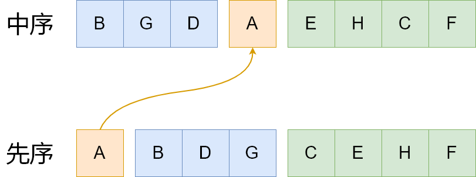
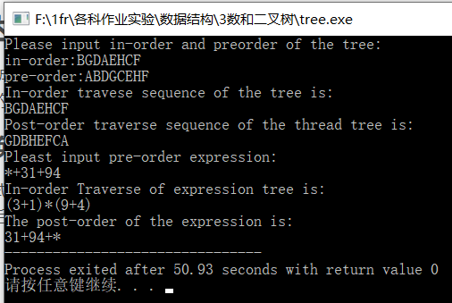

# 实验三 二叉树及其应用

## 实验要求

1. 以三叉链表存储二叉树
2. 依次输入二叉树的**中序**和**先序遍历**的结果来创建二叉树
   * 中序：B, G, D, A, E, H, C, F
   * 先序：A, B, D, G, C, E, H, F


3. 二叉树的遍历：对所建的二叉树进行验证
   * 按__中序__遍历方法遍历该二叉树，看遍历的结果是否与初始输入一致
4. 二叉树的应用：线索二叉树的创建
   * 基于二叉树遍历思想的其它问题的求解：扩展二叉树的存储结构，增加表示直接__后继__线索的链域，给出创建给定二叉树的后序线索化二叉树的程序
5. 线索二叉树的遍历：编写在__后序__线索化树上的遍历算法
6. 二叉树创建的特例——表达式树
   * 实现输入为合法的__波兰式__来创建表达式树
7. 二叉树遍历的特例——表达式树
   * 针对用6创建的表达式树，用3__中序__遍历该树，比较它与实际的中缀式之间的区别
8. 二叉树的应用——表达式转换
   * 输出表达式__逆波兰式__。

## 实验内容

### 1. 以三叉链表存储二叉树

每个二叉树的结点包含以下内容：

```c
typedef struct BNode{
    char key;				//关键字的值
    struct BNode* left;		//左子树
    struct BNode* right;	//右子树
    struct BNode* parent;	//父节点
    int ltag;				//左孩子类型（node/thread）
    int rtag;				//右孩子类型（node/thread）
}BNode, *Btree;
```

### 2.用中序**和**先序遍历结果创建二叉树

思路描述：

先序遍历第一个位置的元素是根结点。利用先序遍历第一个元素将中序遍历序列分成两个子序列，左边的是是根结点左子树的中序遍历，右边是根结点右子树的中序遍历。再根据两个子树的中序遍历序列的个数将先序遍历分割，得到两个子树的先序遍历结果，递归创建得到完整二叉树。



关键代码：

```c
void MakeTree(char* in, char* pre, Btree* T, BNode* parent){
    /*T is root,in is inorder,pre is preorder,parent is T's parent*/
    /*make node for pre[0]*/
    /*put new in-order and pre-order sequence of subtrees into in_new_left, pre_new_left, in_new_right_pre_new_right*/
	if(strlen(in_new_left)) MakeTree(in_new_left, pre_new_left, &((*T)->left), *T);
	if(strlen(in_new_right)) MakeTree(in_new_right, pre_new_right, &((*T)->right), *T);
}
```

### 3.二叉树的遍历：对所建的二叉树进行验证

中序遍历：

```c
void PrintInorder(Btree T){
	/*judge whether '(' and ')' should be printed*/
	if(leftflag) printf("(");
    if(T->left) PrintInorder(T->left);
	if(leftflag) printf(")");
    printf("%c", T->key);
	if(rightflag) printf("(");
    if(T->right) PrintInorder(T->right);
    if(rightflag) printf(")");
    return;
}
```

先中序遍历左子树，再输出当前结点的key，再中序遍历右子树。

### 4.二叉树的应用：后继线索二叉树的创建

建立后继线索二叉树需要分很多种情况讨论。

总的来说：

__前驱：__

* 若右子树存在，前驱为右子树的根结点（①）
* 若右子树不存在，且左子树存在，前驱为左子树的根结点（此时不用将此节点线索化，因为此节点左子树是node）（②）
* 若左右子树均不存在
  * 从此结点开始向上寻找直到找到一个结点，这个结点为右子树，且兄弟存在，前驱为此结点的兄弟。若找到了根，那么前驱为NULL（③）

```c
if((*T)->left == NULL){//左子树为空，需要线索化
	(*T)->ltag = thread;
	BNode* temp = (*T)->parent;
	if((*T)->right) (*T)->left = (*T)->right;//有右孩子，前驱为右孩子 （①）
	else{
		if(temp){//有父节点
			temp = (*T);
            //向上寻找（③）
			while(temp->parent){
				if(temp == temp->parent->right && temp->parent->ltag == node && temp->parent->left) break;
				temp = temp->parent;
			}
			if(temp->parent) (*T)->left = temp->parent->left;
			else (*T)->left = temp->parent;
		}
        //无父节点
		else (*T)->left = NULL;//根结点前驱为NULL
	} 
}
```


__后继：__

* 若此结点为右子树，后继为其父节点（①）
* 若此结点为左子树且兄弟存在，后继为以其兄弟为根的子树的第一个结点（②）
* 若此节点为左子树且兄弟不存在，后继为其父节点（③）
* 若此节点为根，后继为NULL（④）

```c
if((*T)->right == NULL){
	(*T)->rtag = thread;
	BNode* temp = (*T)->parent;
	if(temp){
		if(!flag){//T是左孩子 
			if(temp->right){//(②)
				temp = temp->right;
				(*T)->right = FIRST(temp);
			}
            //(③)
			else (*T)->right = temp;
		}
		else{//T是右孩子 (①)
			(*T)->right = temp; 
		}		
	}
	else (*T)->right = NULL; //(④)
}
```

### 5.线索二叉树的遍历：编写在__后序__线索化树上的遍历算法

从根结点的第一个结点开始，按照Next(t)依次向后找后继

```c
void PrintThread(Btree t){
	if(t == NULL) return;
	printf("%c", t->key);
	PrintThread(Next(t));
	return;
}
```

分情况讨论：

* 此节点rtag是thread，返回t->right（①）
* 此节点为根结点，返回NULL（②）
* 自己是右子树，返回父节点（③）
* 自己是左子树，且兄弟存在，返回兄弟的第一个结点（④）
* 自己是左子树，且兄弟不存在，返回父节点（⑤）

```c
BNode* Next(BNode* t){
	if(t->rtag == thread) return t->right;//(①)
	else {
		if(t->parent == t) return NULL;//根结点 (②)
		else{
			if(t->parent && t->parent->rtag == node && t->parent->right == t) return t->parent;//(③)
			else if(t->parent && t->parent->rtag == node && t->parent->left == t) return FIRST(t->parent->right);//(④)
			else if(t->parent && t->parent->rtag == thread) return t->parent; //(⑤)
			else return NULL;
		}
		
	}
}
```

### 6.二叉树创建的特例——表达式树

利用栈和波兰式创建表达式树。

大致思路：

将波兰式从后往前扫描，每扫描到一个就创建一个结点。若当前的值是非算符，将结点压栈，否则弹出两个结点，以当前结点为根，弹出的两个结点分别是两个子树连接起来，再将当前结点压栈，扫描完毕，栈中应存放表达式树的根结点。

```c
for(i=len-1;i>=0;i--){
	temp = MakeNode(exp[i]);
	if(exp[i] != '+' && exp[i] != '-' && exp[i] != '*' && exp[i] != '/'){
		Push(&S, temp);//找到非算符，压栈
	}
	else {//找到算符
		BNode* t1 = Pop(&S);//弹出两个结点
		BNode* t2 = Pop(&S);
		temp->left = t1;//建成小数
		temp->right = t2;
		temp->ltag = node;
		temp->rtag = node;
		t1->parent = temp;
		t2->parent = temp;
		Push(&S, temp);//再压回去
	}
}
```

### 7.二叉树遍历的特例——表达式树

利用已经写好的PrintInorder遍历表达式树。遇到*和/会输出括号。

### 8.二叉树的应用——表达式转换

先将表达式树线索化，再利用线索二叉树输出后续遍历表达式树，即逆波兰式。

```c
Thread(T_expression);
PrintThread(FIRST(*T_expression));
```

## 实验结果及分析



第五行：正确输出中序序列

第七行：正确输出二叉树的后序遍历序列

第十一行：正确输出中缀表达式

第十三行：正确输出逆波兰式

##  实验小结

在本次实验中，我锻炼了将二叉树后续线索化的技能。我最大的感受是，在写代码前一定要想好写什么，怎样写，绝不能边写边想，这样反而会降低效率，越写越晕。后序线索化二叉树重点在于把所有情况都想到，把指针玩好。这并非易事，消耗了我一定时间