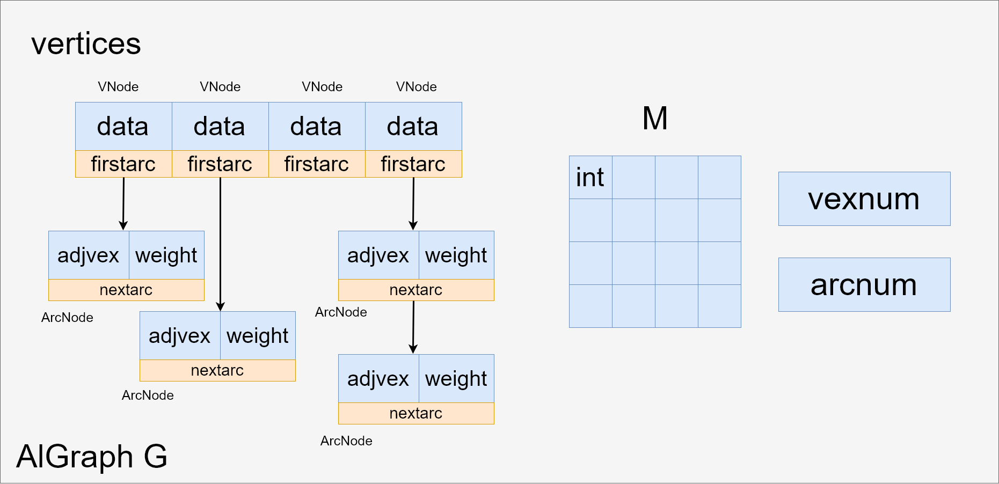
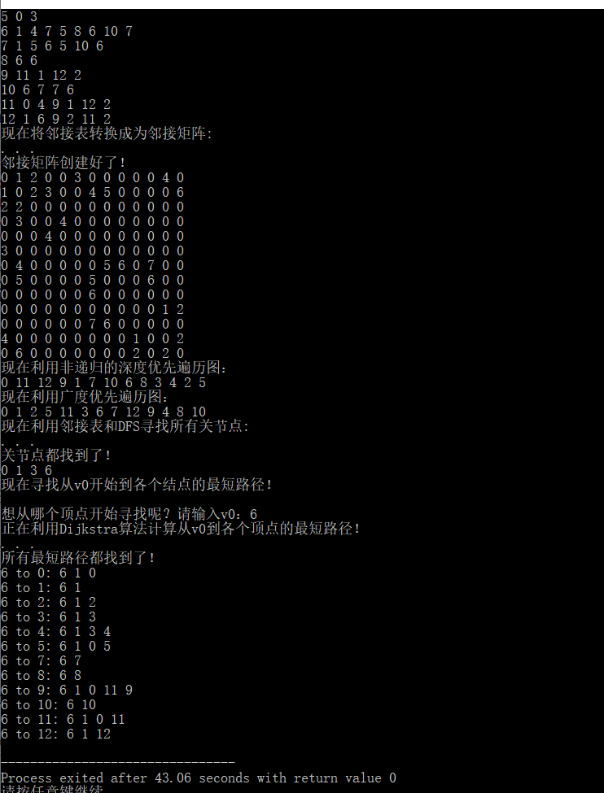
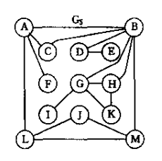

# 实验四 图及其应用

PB17111623

范睿

## 实验要求

1. 图的存储结构的定义和图的创建

   ​	图的种类有：有向图、无向图、有向网、无向网。

   ​	图的存储结构可采用：邻接矩阵、邻接表。

   ​	要求：分别给出邻接矩阵和邻接表在某一种图上的创建算法

2. 图的遍历：非递归的深度优先搜索算法、广度优先搜索算法。

3. 图的深度遍历的应用：求无向连通图中的关节点（教材P177-178,算法7.10和7.11）

4. 图的广度遍历的应用：给定图G，输出从顶点v0到其余每个顶点的最短路径，要求输出各路径中的顶点信息。

5. 对静态链表的体会

## 实验内容

### 0.无向图存储结构

```c
typedef struct ArcNode{//存储每条边的信息
	int adjvex;
	struct ArcNode *nextArc;
	int weight;
}ArcNode;

typedef struct VNode {//存储每个结点信息
	int data;
	ArcNode *firstarc;
}VNode, AdjList[MAX_VERTEX_NUM];

typedef struct {
	AdjList vertices;//邻接表
	int** M;//邻接矩阵
	int vexnum, arcnum;//结点个数、边个数
}AlGraph;
```



### 1.利用输入的邻接表生成邻接矩阵

#### 读入邻接表

```C
AlGraph buildAdjList(){/*此代码不是真正代码，和真正代码逻辑相同*/
    while(/*还没输入完步*/){
		gets(s);
        data <- decode(s);//s中数据以数字、空格交替的形式输入进来，解析之后数字存放在data中
        G.vertices[data[0]].data=data[0];//data[0]存放此结点
        p = G.vertices.firstarc;
        while(p){
            p->adjvex = data[index];//data[1]~data[n]存放每个边的邻接点和权重
            p->weight = data[index+1];
            index+=2;
        }
    return G；
}
```

输入形式：

n

v1 v11 w11 v12 w12...

v2 v21 w21 v22 w22...

...

vn vn1 wn1 vn2 wn2...

n为结点个数

后面的每一行的第一个数为结点，后面的vij和wij表示边和该边的权重。

每次读入一行字符串，解码之后将所有数字存储下来(data)，利用data去创建data[0]这一行的邻接表。

#### 生成邻接矩阵

```c
	for (i = 0; i < n; i++) {//第i行
		VNode p = G.vertices[i];
		ArcNode* q = p.firstarc;
		while (q) {
            //邻接表中p.data和q->adjvex的位置放q->weight
			G.M[p.data][q->adjvex] = q->weight;
			q = q->nextArc;
		}
	}
```

遍历G.vertices，在每一个VNode生成该结点对应的邻接矩阵的一行。

有边的地方放置该边的weight，没有边的地方放权重。

### 2.图的遍历：非递归的深度优先搜索算法、广度优先搜索算法

#### 非递归的深度优先搜索算法

```c
void DepthTraverse(AlGraph G) {
	int stack[MAX_VERTEX_NUM];
	int top = 0;
	int visited[G.vexnum];
	int instack[G.vexnum];
	int i;
	for(i=0; i<G.vexnum; i++) {
		visited[i]=0;
		instack[i]=0;
	}
	stack[top++]=G.vertices[0].data;//0入栈，从0结点开始
	instack[0]=1;
	while(top!=0) {
		int topnode = stack[--top];//pop
		if(visited[topnode]) continue;//若top结点以被访问过，继续执行
        
		//visit topnode
		printf("%d ", topnode);
		visited[topnode] = 1;
		instack[topnode] = 0;
        
        //将topnode所有满足条件的邻接点压栈
		ArcNode* p = G.vertices[topnode].firstarc;
		while(p) {
			if(visited[p->adjvex] == 0 && instack[p->adjvex] == 0) {
				stack[top++] = p->adjvex;
			}
			p = p->nextArc;
		}
	}
	printf("\n");
	return;
}
```

利用栈实现：

1. 先将0结点压栈
2. 进入循环，每次循环时先pop一个，若没有被访问过，访问它，并将它所有邻接点中没有被访问过的且不在栈中的结点压栈。栈空时循环结束。

#### 广度优先搜索算法

```c
void BreadthTraverse(AlGraph G) {
	int queue[MAX_VERTEX_NUM];
	int front=0,rare=0;
	int visited[G.vexnum];
	int inqueue[G.vexnum];
	int i;
	for(i=0; i<G.vexnum; i++) {
		visited[i]=0;
		inqueue[i]=0;
	}
	queue[rare++]=G.vertices[0].data;//0入队

	while(rare!=front) {
		int frontnode = queue[front++];//出队
        if(visited[frontnode]) continue;
        
		//visit frontnode
		printf("%d ", frontnode);
		visited[frontnode] = 1;
		inqueue[frontnode] = 0;
        
        //将frontnode中所有满足条件的邻接点入队
		ArcNode* p = G.vertices[frontnode].firstarc;
		while(p) {
			if(visited[p->adjvex] == 0 && inqueue[p->adjvex] == 0) {
				queue[rare++] = p->adjvex;
			}
			p = p->nextArc;
		}
	}
	printf("\n");
	return;
}
```

思路：利用队列：

1. 将0入队
2. 只要队不为空，出队一个元素，visit它，并将它所有为被访问过且不在队中的元素入队

### 3.图的深度遍历的应用：求无向连通图中的关节点

```c
void FindArticul(AlGraph G) {
	count = 1;
	int* visited = (int*)malloc(sizeof(int)*G.vexnum);
	visited[0] = 1;
	int i;
	for (i = 1; i < G.vexnum; i++) visited[i] = 0;
	ArcNode* p = G.vertices[0].firstarc;
	int v = p->adjvex;//从第0个结点的第一个邻点开始搜
	DFSArticul(G, v, visited);//深度优先搜索v结点
    
    //若还有结点没有被搜到，说明有多个生成树，继续搜索第0结点的下一个邻点
	if (count < G.vexnum) {
		Articul[G.vertices[0].data] = 1;//根为关节点
		while (p->nextArc) {
			p = p->nextArc;
			v = p->adjvex;
			if (visited[v] == 0) DFSArticul(G, v, visited);
		}
	}
	free(visited);
	return;
}
```

```c
void DFSArticul(AlGraph G, int v0, int* visited) {
	visited[v0] = ++count;//v0是第count个被访问的结点
	int min = count;
	ArcNode* p;
	for (p = G.vertices[v0].firstarc; p; p = p->nextArc) {//检查v0的每个邻接顶点 
		int w = p->adjvex;
		if (visited[w] == 0) {//w未访问，w是v0在生成树上的孩子，dfs计算low[w]
			DFSArticul(G, w, visited);
			if (low[w] < min) min = low[w];
			if (low[w] >= visited[v0]) Articul[G.vertices[v0].data] = 1;
		}
		else if (visited[w] < min) min = visited[w];//w访问了，说明w是v0生成树上的祖先
	}
	low[v0] = min;//
	return;
}
```

### 4. 图的广度遍历的应用：给定图G，输出从顶点v0到其余每个顶点的最短路径

思路：利用dijkstra算法。

设总结点数目为 n。开设一个大小为 2xn 的二维数组 Mark。在 Mark 中， Mark[0]中存放起点到各个结点的最短距离（初始化除去起点外的距离均为无穷，起点为 0） ， Mark[1]存放在到达第 i 个结点的最短路径中， i 的上一个结点编号（若距离为无穷，则 Mark[1]相应位置中存放-1） 。
再开设一个 1xn 的一维数组 record。 若已找到从起点到第 i 个结点的最短路径，则将 i 加入 record 中，表明其已被标记。
若还存在没有被加入 record 的结点，则找到这些结点与起点的距离最小的结点，设为 k。先将 k 加入 record，然后更新 Mark 表。更新原则为：若 p 与 k 相邻且 p 没有被加入 record，则对比（起点到 p 的直接距离） 和（起点到 k 的直接距离+k 到 p 的距离） 。若后者小，则将 Mark[0]中 p 的位置更新为后者数值， Mark[1]中 p 的位置更新为 k（表示 k 为 p 的上一个位置） 。若前者小，则什么也不做。这个循环会一直进行下去知道全部结点均被加入 record。
当全部结点均被标记，根据 Mark 数组寻找从起点到终点的轨迹。开设一个 1xn 的数组 path。先将终点加入 path。 若在 Mark[1]中， path 中最后一个结点对应的位置记录的不是起点，则将该结点加入 path，如此循环，直到找到起点。这样从终点到起点的反向路径就被找到了。 

```c
	while(MarkNum != G.vexnum) {//若还有结点没有被标记
		UpdateMark(G, (int*)Mark, record, S);//先更新mark数组
        //找到mark中未标记的结点中距离起点最小的结点
		S[MarkNum-1] = MinMark(G, (int*)Mark, record);
        //将该结点标记
		record[S[MarkNum-1]] = 1;
	}
```

### 5. 对静态链表的体会

静态链表占有更少的空间，且具有链式结构，不用更改指针等操作，可以通过下标访问，而不需要向动态链表那样通过遍历访问，比较方便；但是静态链表有时会比较浪费空间，且不太灵活，不能根据空间需求随时改变，且移动数据的操作麻烦，不如动态链表。当选择链式存储结构时，可以根据空间、操作等需求来选择哪一种链表。虽然动态链表用的次数比较多，但是并不代表静态链表可以完全不被考虑。在移动数据的操作较少时，静态链表或许是更好选择。

## 实验结果



输入的图：



6是G点，赋了权值后的G到A（6 to 0）的最短路径为G-B-A(6-1-0)，结果与真实一致。


