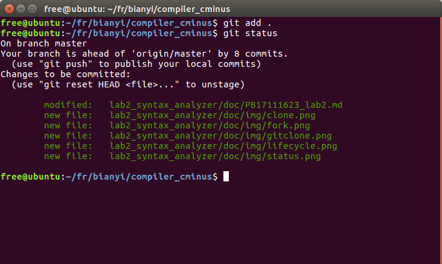

# lab2_syntax_analyzer
PB17111623 范睿
## 实验要求
利用Flex和Bison，根据正则表达式的定义和C-语法识别C-代码等词法分析和语法分析，并创建及打印语法树。
## 实验设计
所有的TODO：common.c, syntax_analyzer.y
### common.c
common.c文件中只需要实现getAllTestcase()函数。此函数於lab1中的同名函数大致相同，将lab1中的实现拷贝过来，只补充了对files_count变量等声明，头文件的增加以及返回值的更改（将返回值由原来的void改变为int，返回files_count的值）
### syntax_analyzer.y
此文件实现了语法分析功能，需要实现的部分有union, token defination, rules。
#### union
union实现所有的终结符和非终结符的可能成为的类型的一种，将来在定义文法符号时，可以通过<>内书写变量名的方式定义每一个文法符号的类型。
```
%union {
struct _SyntaxTreeNode* a; //所有的非终结符都是a的类型
int num;	//NUMBER
char* name; //所有非NUMBER的终结符
}
```
#### token defination
此区域定义了所有token的类型。
以```%token <a> symbol ```的形式可以将symbol这个从词法分析返回的token定义为和union中a一样的类型。
以```%type <a> symbol```的形式可以定义非终结符等类型，规则同上。
我将所有非终结符定义为树的结点型，所有非NUMBER的终结符都定义为字符串，NUMBER定义为int（但实际上后面实现的过程中我并没有用到非终结符的类型。）
```
%token <name> ERROR 258
%token <name> ADD 259 SUB 260 MUL 261 DIV 262 LT 263 LTE 264 GT 265 GTE 266 EQ 267 NEQ 268
%token <name> ASSIN 269
%token <name> SEMICOLON 270 COMMA 271 LPARENTHESE 272 RPARENTHESE 273 LBRACKET 274 RBRACKET 275 LBRACE 276 RBRACE 277
%token <name> ELSE 278 IF 279
%token <name> INT 280 
%token <name> RETURN 281 VOID 282
%token <name> WHILE 283
%token <name> IDENTIFIER 284
%token <num> NUMBER 285

%type <a> identifier number
%type <a> program declaration-list declaration var-declaration type-specifier fun-declaration params 
%type <a> param-list param compound-stmt local-declarations statement-list statement expression-stmt 
%type <a> selection-stmt iteration-stmt return-stmt expression var simple-expression relop additive-expression addop term mulop factor call args arg-list
%start program
```
#### rules
所有rules的实现都是基于C-的语言规则。
归约法则的格式是这样的：
如果一个产生式可以写成这样：declaration-list ->declarationlist declaration
那么在规则部分的格式如下：
```
declaration:
	declarationlist declatation {}
	;
```
大括号内写c代码，表明当按照此规则跪约时，要做那些动作。

建树的过程是这样的：
当按照任意一个产生式归约时（产生式右边的所有非终结符的结点已经存在，可以直接通过$+数字引用）

1. 先给产生式左边的文法符号新建一个树的结点。
2. 若产生式右边有非终结符，那么给这个非终结符也新建一个树的结点。
3. 将产生式右边的所有文法符号依次加入左边结点的孩子。

建树的过程，我实现在 __CreateTree(char* name, int num, ...)__ 函数中。
在动作中，\"$$"可以代表产生式左边的文法符号对应的变量，其类型定义在token defination中。比如，program在token defination中被定义为和< a >的类型一样那么"$ $"就是一个指向树结点的指针。
"$1"代表产生式右部第一个文法符号对应的变量，其类型也定义在token defination中，$2, $3...同理。
``` 
program : 
	declaration-list {$$ = CreateTree("program", 1, $1);gt->root = $$;}
 	;
declaration-list:
	declaration-list declaration {$$ = CreateTree("declaration-list", 2, $1, $2);}
	|declaration {$$ = CreateTree("declaration-list", 1, $1);}
	;
declaration:
	var-declaration {$$ = CreateTree("declaration", 1, $1);}
	|fun-declaration {$$ = CreateTree("declaration", 1, $1);}
	;
	... ...
```
__CreateTree(char* name, int num, ...)__ 是一个接受变长参数的函数，要包含stdarg.h头文件。
第一个参数name为一个字符串，表示产生式左边的文法符号等名字，函数内将要给它产生一个树的结点。
num表示产生式右部的文法符号的个数。
...表示依次传入的文法符号对应的变量，由于我在调用时传递的全是树的结点类型，所以num后面跟着num个指向树的结点的指针。参数传递的过程是将参数从右往左依次压栈，所以依次取参数的过程是不断弹出的过程。
```
SyntaxTreeNode* CreateTree(char* name, int num, ...){
	va_list valist;//定义一个参数列表
	SyntaxTreeNode* root = newSyntaxTreeNode(name);//为name生成一个新结点
	va_start(valist, num);//获取参数列表，并从num开始弹出
	SyntaxTreeNode* temp;
	while(num){
		temp = va_arg(valist, SyntaxTreeNode*);//temp接收每次弹出的非终结符得树结点
		SyntaxTreeNode_AddChild(root, temp);//加入产生式左部符号结点的孩子
		num--;
	}
	return root;//返回产生式左部结点指针
}
```
#### 处理注释、空格及换行符
由于归约法则中没有注释、空格和换行符，那么如果得到了他们的token的话会报错。我的处理方法是在.l文件中将原本是return COMMENT; return BLANK; return EOL;的语句注释掉。当识别到它们等token时，不返回，继续识别。
#### Flex与Bison的共享变量
Flex与Bison的共享变量由yytext和lines，便于在Bison在出错时输出错误在文件中的位置。
### 实验结果
lab2_expression-assign.syntax_tree的输出结果为：
```
>--+ program
|  >--+ declaration-list
|  |  >--+ declaration
|  |  |  >--+ fun-declaration
|  |  |  |  >--+ type-specifier
|  |  |  |  |  >--* int
|  |  |  |  >--* main
|  |  |  |  >--* (
|  |  |  |  >--+ params
|  |  |  |  |  >--* void
|  |  |  |  >--* )
|  |  |  |  >--+ compound-stmt
|  |  |  |  |  >--* {
|  |  |  |  |  >--+ local-declarations
|  |  |  |  |  |  >--* epsilon
|  |  |  |  |  >--+ statement-list
|  |  |  |  |  |  >--+ statement-list
|  |  |  |  |  |  |  >--+ statement-list
|  |  |  |  |  |  |  |  >--* epsilon
|  |  |  |  |  |  |  >--+ statement
|  |  |  |  |  |  |  |  >--+ expression-stmt
|  |  |  |  |  |  |  |  |  >--+ expression
|  |  |  |  |  |  |  |  |  |  >--+ var
|  |  |  |  |  |  |  |  |  |  |  >--* a
|  |  |  |  |  |  |  |  |  |  >--* =
|  |  |  |  |  |  |  |  |  |  >--+ expression
|  |  |  |  |  |  |  |  |  |  |  >--+ var
|  |  |  |  |  |  |  |  |  |  |  |  >--* b
|  |  |  |  |  |  |  |  |  |  |  >--* =
|  |  |  |  |  |  |  |  |  |  |  >--+ expression
|  |  |  |  |  |  |  |  |  |  |  |  >--+ simple-expression
|  |  |  |  |  |  |  |  |  |  |  |  |  >--+ additive-expression
|  |  |  |  |  |  |  |  |  |  |  |  |  |  >--+ additive-expression
|  |  |  |  |  |  |  |  |  |  |  |  |  |  |  >--+ term
|  |  |  |  |  |  |  |  |  |  |  |  |  |  |  |  >--+ factor
|  |  |  |  |  |  |  |  |  |  |  |  |  |  |  |  |  >--+ var
|  |  |  |  |  |  |  |  |  |  |  |  |  |  |  |  |  |  >--* c
|  |  |  |  |  |  |  |  |  |  |  |  |  |  >--+ addop
|  |  |  |  |  |  |  |  |  |  |  |  |  |  |  >--* +
|  |  |  |  |  |  |  |  |  |  |  |  |  |  >--+ term
|  |  |  |  |  |  |  |  |  |  |  |  |  |  |  >--+ factor
|  |  |  |  |  |  |  |  |  |  |  |  |  |  |  |  >--+ var
|  |  |  |  |  |  |  |  |  |  |  |  |  |  |  |  |  >--* d
|  |  |  |  |  |  |  |  |  >--* ;
|  |  |  |  |  |  >--+ statement
|  |  |  |  |  |  |  >--+ return-stmt
|  |  |  |  |  |  |  |  >--* return
|  |  |  |  |  |  |  |  >--+ expression
|  |  |  |  |  |  |  |  |  >--+ simple-expression
|  |  |  |  |  |  |  |  |  |  >--+ additive-expression
|  |  |  |  |  |  |  |  |  |  |  >--+ term
|  |  |  |  |  |  |  |  |  |  |  |  >--+ factor
|  |  |  |  |  |  |  |  |  |  |  |  |  >--* 0
|  |  |  |  |  |  |  |  >--* ;
|  |  |  |  |  >--* }
```
函数调用的先后顺序为：
main->syntax_main->syntax->yyparse->Flex/Bison/Flex/Biosn...(词法分析+语法分析)->fprintf->return

|	文法符号栈	|	输入缓冲区		|	action	|
| ----------------------------- | ---------------------------------- | ------------------- |
|$|int main(void)\n\{\n\t a = b = c + d;\n\treturn 0;\n}$||
|$INT|main(void)\n\{\n\t a = b = c + d;\n\treturn 0;\n}$|移进|
|$type-specifier|main(void)\n\{\n\t a = b = c + d;\n\treturn 0;\n}$|type-specifier->INT|
|$type-specifier IDENTIFIER|(void)\n\{\n\t a = b = c + d;\n\treturn 0;\n}$|移进|
|$type-specifier IDENTIFIER LPARENTHESE|void)\n\{\n\t a = b = c + d;\n\treturn 0;\n}$|移进|
|$type-specifier IDENTIFIER LPARENTHESE VOID|)\n\{\n\t a = b = c + d;\n\treturn 0;\n}$|移进|
|$type-specifier IDENTIFIER LPARENTHESE params|)\n\{\n\t a = b = c + d;\n\treturn 0;\n}$|params->VOID|
|$type-specifier IDENTIFIER LPARENTHESE params RPARENTHESE|\n\{\n\t a = b = c + d;\n\treturn 0;\n}$|移进|
|$type-specifier IDENTIFIER LPARENTHESE params RPARENTHESE LBRACE|a = b = c + d;\n\treturn 0;\n}$|移进|
|$type-specifier IDENTIFIER LPARENTHESE params RPARENTHESE LBRACE  |a = b = c + d;\n\treturn 0;\n}$|移进|
|$type-specifier IDENTIFIER LPARENTHESE params RPARENTHESE LBRACE local-declarations|a = b = c + d;\n\treturn 0;\n}$|local-declarations->(epsilon)|
|$type-specifier IDENTIFIER LPARENTHESE params RPARENTHESE LBRACE local-declarations  |a = b = c + d;\n\treturn 0;\n}$|移进|
|$type-specifier IDENTIFIER LPARENTHESE params RPARENTHESE LBRACE local-declarations statement-list|a = b = c + d;\n\treturn 0;\n}$|statement-list->(epsilon)|
|$type-specifier IDENTIFIER LPARENTHESE params RPARENTHESE LBRACE local-declarations statement-list IDENTIFIER|= b = c + d;\n\treturn 0;\n}$|移进|
|$type-specifier IDENTIFIER LPARENTHESE params RPARENTHESE LBRACE local-declarations statement-list var|= b = c + d;\n\treturn 0;\n}$|var->IDENTIFIER|
|$type-specifier IDENTIFIER LPARENTHESE params RPARENTHESE LBRACE local-declarations statement-list var ASSIN|b = c + d;\n\treturn 0;\n}$|移进|
|$type-specifier IDENTIFIER LPARENTHESE params RPARENTHESE LBRACE local-declarations statement-list var ASSIN IDENTIFIER|= c + d;\n\treturn 0;\n}$|移进|
|$type-specifier IDENTIFIER LPARENTHESE params RPARENTHESE LBRACE local-declarations statement-list var ASSIN var|= c + d;\n\treturn 0;\n}$|var->IDENTIFIER|
|$type-specifier IDENTIFIER LPARENTHESE params RPARENTHESE LBRACE local-declarations statement-list var ASSIN var ASSIN|c + d;\n\treturn 0;\n}$|移进|
|$type-specifier IDENTIFIER LPARENTHESE params RPARENTHESE LBRACE local-declarations statement-list var ASSIN var ASSIN IDENTIFIER|+ d;\n\treturn 0;\n}$|移进|
|$type-specifier IDENTIFIER LPARENTHESE params RPARENTHESE LBRACE local-declarations statement-list var ASSIN var ASSIN var|+ d;\n\treturn 0;\n}$|var->IDENTIFIER|
|$type-specifier IDENTIFIER LPARENTHESE params RPARENTHESE LBRACE local-declarations statement-list var ASSIN var ASSIN factor|+ d;\n\treturn 0;\n}$|factor->var|
|$type-specifier IDENTIFIER LPARENTHESE params RPARENTHESE LBRACE local-declaration statement-list var ASSIN var ASSIN term|+ d;\n\treturn 0;\n}$|term->factor|
|$type-specifier IDENTIFIER LPARENTHESE params RPARENTHESE LBRACE local-declarations statement-list var ASSIN var ASSIN additive-expression|+ d;\n\treturn 0;\n}$|additive-expression->term|
|$type-specifier IDENTIFIER LPARENTHESE params RPARENTHESE LBRACE local-declarations statement-list var ASSIN var ASSIN additive-expression ADD|d;\n\treturn 0;\n}$|移进|
|$type-specifier IDENTIFIER LPARENTHESE params RPARENTHESE LBRACE local-declarations statement-list var ASSIN var ASSIN additive-expression addop|d;\n\treturn 0;\n}$|addop-ADD|
|$type-specifier IDENTIFIER LPARENTHESE params RPARENTHESE LBRACE local-declarations statement-list var ASSIN var ASSIN additive-expression addop IDENTIFIER|;\n\treturn 0;\n}$|移进|
|···|···|···|
|$type-specifier IDENTIFIER LPARENTHESE params RPARENTHESE LBRACE local-declarations statement-list var ASSIN var ASSIN additive-expression addop term|;\n\treturn 0;\n}$|term->factor|
|$type-specifier IDENTIFIER LPARENTHESE params RPARENTHESE LBRACE local-declarations statement-list var ASSIN var ASSIN additive-expression|;\n\treturn 0;\n}$|additive-expression->additive-expression addop term|
|$type-specifier IDENTIFIER LPARENTHESE params RPARENTHESE LBRACE local-declarations statement-list var ASSIN var ASSIN simple-expression|;\n\treturn 0;\n}$|simple-expression->additive-expression|
|$type-specifier IDENTIFIER LPARENTHESE params RPARENTHESE LBRACE local-declarations statement-list var ASSIN var ASSIN expression|;\n\treturn 0;\n}$|expression->simple-expression|
|$type-specifier IDENTIFIER LPARENTHESE params RPARENTHESE LBRACE local-declarations statement-list var ASSIN expression|;\n\treturn 0;\n}$|expression->var ASSIN expression|
|$type-specifier IDENTIFIER LPARENTHESE params RPARENTHESE LBRACE local-declarations statement-list expression|;\n\treturn 0;\n}$|expression->var ASSIN expression|
|$type-specifier IDENTIFIER LPARENTHESE params RPARENTHESE LBRACE local-declarations statement-list expression SEMICOLON|return 0;\n}$|移进|
|$type-specifier IDENTIFIER LPARENTHESE params RPARENTHESE LBRACE local-declarations statement-list expression-stmt|return 0;\n}$|expression-stmt->expression SEMICOLON|
|$type-specifier IDENTIFIER LPARENTHESE params RPARENTHESE LBRACE local-declarations statement-list statement|return 0;\n}$|statement->expression-stmt|
|$type-specifier IDENTIFIER LPARENTHESE params RPARENTHESE LBRACE local-declarations statement-list|return 0;\n}$|statement-list->statement-list statement|
|···|···|···|
|$type-specifier IDENTIFIER LPARENTHESE params RPARENTHESE LBRACE local-declarations statement-list statement|}$|statement->return-stmt|
|$type-specifier IDENTIFIER LPARENTHESE params RPARENTHESE LBRACE local-declarations statement-list|}$|statement-list->statement-list statement|
|$type-specifier IDENTIFIER LPARENTHESE params RPARENTHESE LBRACE local-declarations statement-list RBRACE|$|移进|
|$type-specifier IDENTIFIER LPARENTHESE params RPARENTHESE compound-stmt|$|compound-stmt->LBRACE local-declarations statement-list RBRACE|
|$fun-declaration|$|fun-declaration->type-specifier IDENTIFIER LPARENTHESE params RPARENTHESE compound-stmt|
|$declaration|$|declaration->fun-declaration|
|$declaration-list|$|declaration-list->declaration|
|$program|$|program->declaration-list|
|$program|$|接受|

### 实验难点
#### $+数字无法传入终结符字符串
本来我在所有动作中对于非终结符的代表都是用$+数字，比如
```
type-specifier:
	INT {$$ = CreateTree("type-specifier", 1, newSyntaxTreeNode($1));}
	|VOID {$$ = CreateTree("type-specifier", 1, newSyntaxTreeNode($1));}
	;
```
但是这样总在报错。当我试图将$1作为字符串输出时，我发现什么也没有输出。我不知道原因。我问了问同学，有的同学说他们没问题，我也无从下手debug。
因此我改变了实现方式。
对于那些确定的终结符（除NUMBER和IDENTIFIER），我直接传递他们的名字，比如
```
type-specifier:
	INT {$$ = CreateTree("type-specifier", 1, newSyntaxTreeNode(“int”));}
	|VOID {$$ = CreateTree("type-specifier", 1, newSyntaxTreeNode(“void”));}
	;
```
对于不确定的终结符，NUMBER和IDENTIFIER，定义一个新的非终结符，number和identifier，它们的类型也规定为树结点型。他们的归约法则为
```
identifier:
	IDENTIFIER {$$ = newSyntaxTreeNode(yytext);}
	;
number:
	NUMBER {$$ = newSyntaxTreeNodeFromNum(atoi(yytext));}
	;
```
意思是，当识别到IDENTIFIER时，按照identifier -> IDENTIFIER进行归约，归约进行的动作是给yytext包含的字符串创造一个树结点。NUMBER类似。
#### 段错误
代码初步完成后出现了segmentation fault错误。我觉得是指针指的有问题。我在CreateTree函数中输出了每次穿进来等name和被加入等子结点的名字，发现，在识别“==”时，出现了问题。于是我找到了relop的归约动作，发现我忘记把创造出来的新结点的指针赋值给$ $
### 实验总结
在本次实验中，我实现了利用flex和Bison建立C-语言的语法树。现在我对词法分析和语法分析的过程有了大致清晰的思路。其实就像消消乐一样：字符流被读入，遇到了匹配上的正则表达式，就按照规则进行匹配，生成token，如果可以归约成非终结符，就按照非终结符的产生式进行规约。边读入字符流，边建立语法树，读完了，也就建完了。中间任何一个位置出现不匹配的情况，都报错并退出。

另外，我在这次实验中还正式成为了一名git用户。我用以下的方法成功merge了助教的代码并push到了我的帐号下。

__1. 首先，将助教的仓库fork到我的主页下__


__2. 将我的远程仓库clone到本地__
先点下面那个HTTP复制

再打开终端，想把仓库放在哪里就进入那个文件夹，输入

然后输入用户名和密码，会发现文件夹中多了一个和仓库同名的文件夹，打开后里面的内容和远程仓库一样。

__3. (此时助教更新了仓库代码，我需要把助教的仓库在拉下来)将助教的仓库加入我的本地仓库的远程仓库__
```
free@ubuntu:~/fr$ git remote add upstream git@210.45.114.30:staff/compiler_cminus.git
```
这条令需要在本地仓库第一级目录下运行才行。
它的意思是：将最后这个链接指向的仓库加入我的远程仓库，我在这里叫他upstream（可以换成别的名字）。这样现在我就有两个远程仓库了，一个叫origin，就是我的帐号下的那个、我刚刚clone下来的那个仓库，另一个叫upstream，是我刚刚加入的、助教的仓库。如果我还想再加别的远程仓库，我可以还按照同样的格式进行加入，前提是我有那个远程仓库的读权限。

__4. 将助教的代码拉取过来(fetch)再和本地仓库合并(merge)__
合并的意思是，将我和助教仓库中各自独有的部分均保留，相同名字的文件中不同的部分也都保留下来，并将他们用====分开，方便我之后来选择我想留哪一部分的代码。
可以用git pull赖代替fetch和merge这两个过程。
进入本地仓库第一级文件夹下，运行：
```
free@ubuntu:~/fr/bianyi/compiler_cminus$ git pull upstream master
```
这条命令执行了fetch和merge的动作，如果有冲突的文件，在终端中会报错。

__5. 写好lab2的代码，直到可以提交的状态__

__6.追踪所有修改过的文件、提交它们，并上传到我自己帐号下的远程仓库__
现在写好了所有代码，我对本地仓库中的许多文件都发生了改动，在git中，所有的文件都有许多状态。 

上图描述了一个文件在git仓库中的生命周期。
Untracked(未跟踪)：所有新建的文件或者新删除的文件在刚被操作完后的状态都是”未跟踪“。
Unmodified(未修改)：刚clone下来的，或者刚刚commit后的所有文件都是未修改状态。
Modified(已修改)：对仓库中已存在的文件进行修改会将其状态从未修改变为已修改。
Staged(已暂存)：对於未跟踪和已修改的文件进行暂存会将他们的状态变为已暂存。

如果我们想要将本次仓库push到远程仓库上，git需要本地仓库中的所有文件都是未修改的状态。运行以下命令可以将我们未跟踪和已修改的文件的状态变为未修改。
首先，运行git status来查看文件的状态
```
free@ubuntu:~/fr/bianyi/compiler_cminus$ git status
```

如图可以看到，红色的文件是有问题的。
lab2_syntax_analyzer/doc/PB17111623_lab2.md这个文件的状态时modified。

lab2_syntax_analyzer/doc/img/clone.png
lab2_syntax_analyzer/doc/img/fork.png
lab2_syntax_analyzer/doc/img/gitclone.png
lab2_syntax_analyzer/doc/img/lifecycle.png这些文件的状态时untracked。
现在运行
```
free@ubuntu:~/fr/bianyi/compiler_cminus$ git add .
free@ubuntu:~/fr/bianyi/compiler_cminus$ git status
```
git add命令将所有未跟踪和已修改的文件状态变成了已暂存的状态。现在再来运行以下git status来看看文件的状态。

刚刚红色的文件变成了绿色。

现在运行
```
free@ubuntu:~/fr/bianyi/compiler_cminus$ git commit
```
此命令会打开一个编辑器，我将git的编辑器设置成了vim，于是我打开了这个界面

在第一行输入本次commit更改了哪些内容，然后退出编辑器，会发现commit完成了。

现在已经可以将本地仓库push到远程仓库了，运行
```
free@ubuntu:~/fr/bianyi/compiler_cminus$ git push origin master
```
push成功

现在打开git帐号，就可以发现我的远程仓库库和本次仓库同步了！
另：
更改git编辑器的方法：
安装git后，运行
```
(shell) $ git config --global core.editor vim
```
就可以把编辑器改成vim。当然改成emacs的话就把vim改成emacs就星。

reference: git-scm.com

### 实验反馈
#### 提出问题
我认为实验手册 __可以并且需要__ 做的更好。
前两次的实验手册都属于短小精悍的类型。语言高度概括、高度抽象，作为初学者的我们只能通过 __摸索__ 写实验。
我认为对于一个新手同学的实验手册应该是 __非常非常详尽的__ 。我也是一门实验课的助教，我带的是模拟与数字电路实验。这门课对于大二学生来说也是让他们接触一个全新的语言。所以我知道，如果实验手册有一点点没有解释清楚、太过抽象的话，会引起多少同学的疑惑。
有一个助教在一个issue的回答是这样的：
>至于整体上实验怎么做我们的确没有太多去考虑如何去说，因为一句话就能说完：“仿照实验1中Flex的代码结构和发布的计算器项目设计CMinus编译器的语法分析器部分代码”，这个在白助教的PPT上已经讲了，而且 __不太可能再往太细了讲__ 。

我认为这话说的有点问题，助教一定要让我们清楚我们该如何一步一步的完成我们的目标，这样一句笼统的话让我们毫无头绪。

助教传递有关lab2的信息有：课堂上、ppt、lab2的readme、Bison_Tutorial.md。

课堂上所讲的那些，我们能获取的真得不多。因为那个时候我们还没由开始lab2，没有看过这些代码之间的关系，对lab2没有一个全局的把握，你告诉我同时用bison和flex，.y文件各部分的规则啥啥的，我脑子里没有东西去对应，我听了也保留不了多久，等写代码的时候还是从0开始。

ppt里的介绍只是给你一个大纲，对于细节实现没有指导。

lab2的Readme.md介绍了一个CMake、一个仓库架构的改变、一个lab2我们要实现的、一个merge，我想说，没有解决根本问题。

Bison_Tutorial.md真的太简单了，一个小例子，既没有union，也没能解释清楚flex和bison的关系是怎样的，不能让我们看清楚哪个部分应该以什么样的格式写，我只能通过去搜，去看Bison文档、github上别人的代码、和同学讨论这种方法解决，我相信其他同学也和我一样。__但是，这样的话非常考验一个人的检索以及提取重要信息的能力，一部分人，不如说大部分人在这些能力上有所缺失，这会导致同学们在编译实验上所花的实验陡然增加。__ 这就引起了尤其是像 http://210.45.114.30/gbxu/notice_board/issues/142 这个issue所提出的问题。

#### 解决问题
不过，解决办法也不是没有。我去翻看了CS164的课程主页。CS164是UCB的相当于咱们的编译原理课程。总的来说，CS164的理论课每周三节，一个学期有三个实验，每个实验的时间大约一个月左右。每一个小组提交一份作业。
其中第一个实验，他们实现的是利用JFlex和CUP实现ChocoPy这个语言的AST的建立，和我们的前两个实验很相似。
在他们的实验手册 __（doc/CS164-PA1.pdf）__ 中，我找到了助教们可以参考学习的部分。这份文档中的大部分内容我们的助教也有讲过，我觉得重点在於此文档中的第六部分和第七部分。第六部分对JSON format，AST node kinds有着比较详细的介绍，第七部分给了有关JFLex和CUP的比较关键的指导。其实有时候就是这一些话能让我们“有从下手”去写实验。


