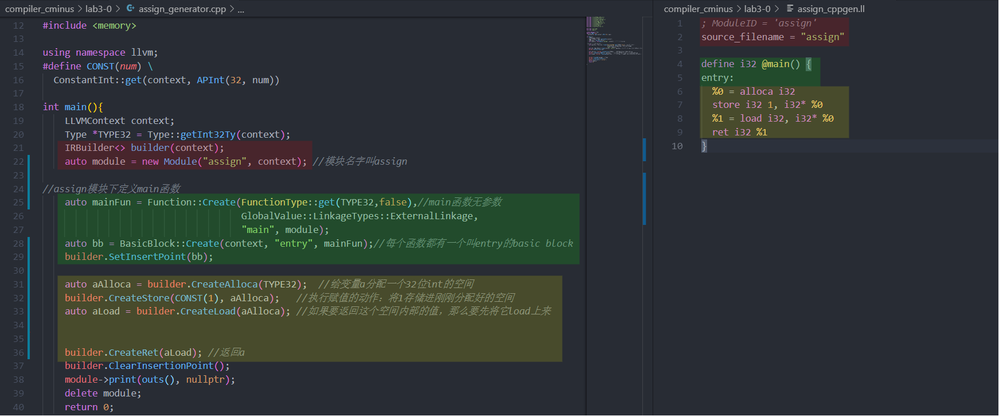

## lab3-0实验报告

范睿

PB17111623

### 实验要求

通过阅读助教给的gcd_generator.cpp和LLVM官方手册等资料，编写4个.cpp文件使之能够生成与assign.c，if.c，while.c，call.c逻辑上相等的llvm代码，和4个与上面4个.c文件逻辑上相等的.ll文件。

### 实验结果

描述我的代码片段和每一个BasicBlock的对应关系。

同样背景颜色的代码相互对应，左边为.cpp文件，右边为.ll文件。
#### assign_generator.cpp



* 红色区域定义了一个module，此module名为assign
* 绿色区域定义了main函数和设置了此函数的入口basicblock
* 黄色区域为entry这个basic block的主题，也是函数的主体，实现了赋值的功能

#### if_generator.cpp


* 红色区域定义了一个module，此module名为if
* 绿色区域定义了main函数和设置了此函数的入口basicblock
* 黄色区域进行了2和1的比较和分支跳转。值得注意的是.ll文件中，br后面直接是i1 true，原因是此判断是两个常数判断，一定为true，.cpp被编译时已得出结果。
* 蓝色区域规定了true的分支
* 紫色区域规定了false的分支

#### while_generator.cpp


* 红色区域定义了一个module，此module名为while
* 绿色区域定义了main函数和设置了此函数的入口basicblock
* 黄色区域先给变量赋值，然后无条件跳转到while basic block
* 浅蓝色区域为while basic block的主体
* 紫色区域为循环条件成立的basic block的主体
* 深蓝色区域为退出循环后的basic block的主体

#### call_genarator.cpp


* 红色区域定义了一个module，此module名为call
* 绿色区域定义了callee函数和设置了此函数的入口basicblock
* 黄色区域为callee函数主体
* 浅蓝色区域定义了main函数和设置了此函数的入口basicblock
* 紫色区域为main函数主体（调用callee）


### 实验难点

#### 编译llvm，release版-j1我也会爆内存，而且比较卡

我本来打算在我电脑里的虚拟机中做，但由于我只给我的虚拟机分了3个G的内存，导致我编译llvm时即使用release和-j1来编译虚拟机也会崩掉。而我又不想给虚拟机分配更多内存，因此我改变了方式。由于数字电路实验，我得到了一个vlab上的服务器。我在服务器上编译好了llvm，非常流畅。然后我在windows本地的vscode中配置了remote-ssh来远程连接vlab的服务器，于是就可以非常方便地写代码+测试输出。

#### 手写的while_hand.ll运行结果为55
刚写完运行检查结果的时候，发现结果为55，而非65。以为是少循环了一次，于是检查while的basic block中判断i和10的大小的那一句话，但是发现没有什么问题。于是开始debug，在不同的basic block中退出，返回某一个寄存器的值，查看是否正确。然后发现，在true的分支中有这样的代码：
```llvm
    %5 = load i32, i32* %1
    %6 = load i32, i32* %0
    %7 = add nsw i32 %6, %2 ;%2是在while分支中load的i的值
```
我在true分支中用了while分支的变量，此时i已经变为了10，而我用的值却是9，导致结果比正确结果少10，如果把最后一行的%2改为%5，则会输出正确结果65

#### git push说remote: HTTP Basic: Access denied
搜了一下发现是因为远程服务端的用户名和密码与当前系统中git保存的用户名和密码有冲突
运行
```bash
sudo git config --system --unset credential.helper
```
来清空本地保存的用户名和密码，然后再git push就行了。

### 实验总结

#### llvm在C++中的接口函数及用法
```c++
auto module = new Module("gcd", context); 
```
此函数定义了一个新的module，第一个参数为此module的名字
```c++
std::vector<Type *> Ints(2, TYPE32);
auto gcdFun = Function::Create(FunctionType::get(TYPE32, Ints, false), GlobalValue::LinkageTypes::ExternalLinkag,"gcd", module);
```
此函数定义了一个新的函数，Ints为它的参数列表。
```c++
auto bb = BasicBlock::Create(context, "entry", gcdFun);
builder.SetInsertPoint(bb);  
```
第一句话定义了一个basic block，它的名字叫entry；第二句话将entry标签插入到llvm代码中。
```c++
auto retAlloca = builder.CreateAlloca(TYPE32);
```
这条代码给返回值分配了空间。定义任何一个变量都要先给他分配一个空间，TYPE32表示它是32位的。
```c++
builder.CreateStore(args[0], uAlloca);
```
这句话给uAlloca这个被分配的空间赋了args[0]的值。我们想对任何一个空间赋值都要用到CreateStore这个函数。第一个参数是赋的值，第二个参数是被赋值的位置。
```c++
auto xLoad = builder.CreateLoad(xAlloca);
```  
这句话将xAlloca处存放的数字load出来，给到xLoad，这样我们才可以用它。xLoad的类型为llvm::LoadInst*，而xAlloca的类型为llvm::Value*。
```c++
call = builder.CreateCall(gcdFun, {xLoad, yLoad});
```
这句话调用了gcdFun这个函数，给这个函数穿的所有参数为{xLoad, yLoad}，而这个函数的返回值存放在call中。
```c++
builder.CreateCondBr(icmp, trueBB, falseBB);
builder.CreateBr(falseBB);
```
这两句话分别是两种形式的分支指令。第一行是条件分支，若icmp为true，跳转到trueBB，否则跳转到falseBB。第二句是无条件跳转指令，直接跳到falseBB处。


#### 用http克隆无密码git push
由于这次实在远程服务器上做的实验，因此需要重新clone一遍。clone完了之后我发现git push时要输密码，很烦。搜了一下发现如果在compiler_cminus下的.git文件夹中的config文件中添加一个：
```
[credential]
    helper = store
```
它可以在第一次输入密码后将密码记住，第二次及以后就都不用输密码了。