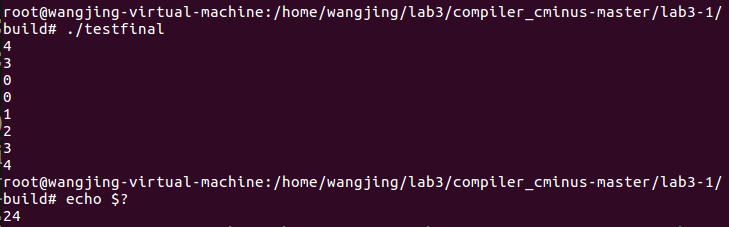

# lab3-1实验报告

孙书情 PB17061266

范睿 PB17111623

王晶 PB17111651

## 实验要求

**在助教提供的自动已完成Flex,Bison生成的语法树到C++语法树的转换的框架上，写出自动根据cminus语法树生成LLVM IR文件的cpp代码。**

具体实现：通过参考cminus_builder.hpp文件以及syntax_tree.hpp等文件，填充cminus_builder.cpp文件中的16个与cminus语法中的终结符/非终结符相关联的函数，实现在语法树上该结点所要执行的具体动作。

## 实验难点

本次实验难点主要聚焦在对C++语法不熟悉、LLVM IR相关的函数类型使用不当、对每个结点的具体操作不清楚以及全局变量的设计有困难上。

下面具体进行说明：

##### 1. 对C++语法不熟悉：

刚开始由于不理解类的继承属性以及访问者模式的概念，通过阅读助教提供的design.md文件以及C++语法的帮助文档、再加上vscode的自动补全功能，勉强可以书写代码。

##### 2. 对语法树上每个结点所执行的动作分析不清晰：

通过小组讨论，我们首先将每个非终结符所要执行的动作记录下来，再填充基础的函数模块，如``syntax_fun_declaration``、``syntax_assign_expression``、``syntax_var_declaration``的局部变量声明等，来完成最简单的测试文件，然后一步一步细化测试文件来检验每一个函数模块的使用是否正确。

##### 3. LLVM IR的函数类型的使用：

借助LLVM IR官方提供的帮助文档，代码的自动补全功能以及clang生成的标准ll文件来判断自己应当使用什么类型。

##### 4. 全局变量的设计：

在下面的实验设计中进行具体说明。

## 实验设计

#### 一、全局变量设计

##### 1.``std::unordered_map<std::string, llvm::Function *> functions``

由于我们在向scope域中插入函数声明后，在后期查找该函数时产生了错误，所以我们在``cminus_builder.cpp``文件中新创建了一个符号表``std::unordered_map<std::string, llvm::Function *> functions``，用于查找声明过的函数，声明的变量、数组仍旧存储在scope域的表中。

* 作用：记录每个函数的地址方便后面查找

##### 2. ``std::unordered_map<std::string, type_specifier> functions_type``

- 记录每个函数的返回值类型。
- 在__visit(syntax_call &*node*) __函数中，作为判断依据，选择不同的语句生成call的llvm IR代码。

##### 3. ``std::vector<std::string>Args``

- 作用
  - 记录当前函数中的参数中的所有数组参数的id名称。
- 设置原因：
  - __Args__将会在__visit(syntax_var &*node*)__中用来作为判断依据。
  - 由于我们对__局部/全局__数组变量和__函数参数__的数组变量的处理不同，我们需要一个向量来记录所有的数组参数名称。
- 初始化和清空：
  - 初始化Args的操作在__visit(syntax_fun_declaration &*node*)__进行。
  - __visit(syntax_fun_declaration &*node*)__结束之前将Args清空。

##### 4. ``static Function* current_function``

作为当前Function的名称生成新的BasicBlock。

##### 5. ``std::vector<Type *> Ints``

* 是syntax_param和syntax_fun_declaration的共享变量
* param中将判断每个

##### 6. ``Value* value_result``

用于存储变量、数组以及数字所在的地址，方便在对一个变量或常量操作时进行取用。

##### 7. ``int ArgType``

call和var共享的变量。若传入的参数是一个数组，那么ArgType为1，否则为0。

##### 8. ``int return_num``

* 用来指示是否需要插入`if_next`语句

#### 二、分析每个结点执行动作

##### 1. syntax_program：

* 给全局变量value_result赋初值
* 遍历program下层的declarations
* 将input和output函数的指针找到压入新建的符号表中，详见“input和output"模块的调用

##### 2. syntax_num ：

* 新开辟一个空间，将node.value值存入，并将地址赋给value_result

##### 3. syntax_var_declaration：

* 通过``scope.in_global``判断声明的变量是全局变量还是局部变量

* 如果是全局变量，用``GlobalVariable``函数来声明新的变量或数组

  ```c
  auto val_ptr = new GlobalVariable(*module.get(),  //声明变量
                                      TYPE32,
                                      false,
                                      GlobalVariable::LinkageTypes::ExternalLinkage,
                                      ConstantAggregateZero::get(TYPE32),
                                      var_name);
  ```

  ```c
   auto val_ptr = new GlobalVariable(*module.get(),//声明数组
                                      ArrayType::get(TYPE32,node.num->value),
                                      false,
                                      GlobalVariable::LinkageTypes::ExternalLinkage,                                    ConstantAggregateZero::get(ArrayType::get(TYPE32,node.num->value)),
                                      var_name);
  ```

* 如果是局部变量，用``CreateAlloca``函数直接声明，只不过数组要用``ArrayType``类型

* 数组的长度均通过``node.num->value``来查找

##### 4. syntax_fun_declaration：

* 通过``Function::Create``函数__创建__新的function

* 通过node.type判断新声明的function的__返回值类型__

  如，返回值为void类型时，创建语句为：

  ```c
  Type* TYPEVOID = Type::getVoidTy(context);
  if(node.type == TYPE_VOID) current_function = Function::Create(FunctionType::get(TYPEVOID, Ints, false), //get后第一个参数表示返回值类型
                                              GlobalValue::LinkageTypes::ExternalLinkage, 
  ```

* 创建一个新的BasicBlock，并通过iterator来获取该函数的参数

* 对于参数为单个变量和数组的类型要分开讨论：

* 为参数分配空间，单个变量空间分配时的函数语句为：

  ```c
  Type* TYPE32 = Type::getInt32Ty(context);
  Value* paramAlloca = builder.CreateAlloca(TYPE32);
  ```

  数组空间分配语句为：

  ```c
  Type* TYPEARR = Type::getInt32PtrTy(context);
  Value* paramAlloca = builder.CreateAlloca(TYPEARR);
  ```

* 将参数声明通过`scope.push`压入符号表中

##### 5. syntax_param ：

对于每一个传进来的参数node，先判断他的类型，若为非数组，将TYPE32压如Ints中，否则将TYPE32PTR压入Ints中。

##### 6. syntax_compound_stmt ：

* 遍历所有local_declarations，每个指针调用自身的accept函数。

##### 7. syntax_expresion_stmt ：

* 对expression_stmt的expression结点调用accept

##### 8. syntax_selection_stmt ：

* 先创建三个新的BasicBlock:if_cond,if_then,和if_next

* 按照`if`,`else`的控制流结构创建新的分支并插入

* 对于有else的情况，需要在访问完node.if_statement后继续插入if_else的block，并访问node.else_statement，最后插入if_next的block

* 没有else的情况则直接在在访问完node.if_statement后插入if_next的block

* 由于会存在如下情况

  ```
  if()
  	return ...;
  else
  	return ...;
  ```

  该结构结束后不存在任何结束语句，故我们设置了一个全局变量`return_num`，当`return_num`为1时不需要插入`if_next`,当`return_num`为0时需要插入`if_next`，故`return_num`的值只有可能为0或1，所以在进入`return_stmt`后需要将`return_num+1`，在`func_declaration`中将`return_stmt`赋为0，在退出`return`语句后将`return_num-1`。

##### 9. syntax_iteration_stmt：

* 按照while的控制流语句进行bb的创建和插入
* 先插入while_loop，然后访问node.expression，由此可通过value_result的值得到while_cond
* 得到while_cond后可以通过`CreateCondBr`函数来创建条件分支模块
* 在遍历了node.statement之后再跳转回while_loop，最后跳到while_next

##### 10. syntax_return_stmt ：

* 若无返回值，直接builder.CreateRetVoid()
* 否则先调用expression，记录返回值，在调用builder.CreateRet(value)

##### 11. syntax_var：

* 主要功能，寻找变量地址及数组某一具体下标对应地址，将该地址存到value_result中

* 判断变量类型：

  * 先利用scope查找变量地址，再根据地址的到Type：

  * ```c++
    auto PTR=scope.find(node.id);
    Type* TYPE32PTR = Type::getInt32PtrTy(context);
    f(PTR->getType() == TYPE32PTR){//利用getType方法返回结果和TYPE32PTR比较
        //非数组
    }
    {
        //数组
    }
    ```

* 非数组：查找变量地址

  ```c
   val_ptr=scope.find(node.id);
  ```

* 数组：查找某一数组下标对应地址

  * 分类讨论，有地址值和无地址值

  * 有地址：判断地址是否小于零

  * ```c++
    //先通过expression获取偏移地址，存放在value_result中
    //判断地址是否小于0
    //若小于0：
    builder.SetInsertPoint(trueBB);
    builder.CreateCall(functions["neg_idx_except"]);
    //不小于0：
    builder.CreateRetVoid();
    builder.SetInsertPoint(falseBB);//继续执行下面的语句
    
    ```

  * 无地址：获取数组（a）首地址（&a[0]）

  * ```c++
    auto zero = builder.CreateAlloca(TYPE32)；
    builder.CreateStore(CONST(0), zero);//存一个0
    value_result = zero;
    ArgType = 1;//这表明value_result里存的是数组基地址，不用load
    
    ```

  * 经过上面的步骤，value_result中一定存了一个偏移地址，下面获取该数组元素的地址

  * ```c++
    auto index = builder.CreateLoad(value_result);
    
    ```

  * 在分类讨论：是函数参数数组和非函数参数数组：

    * 函数参数数组

    * ```c++
      auto PTR1 = builder.CreateLoad(PTR);
      //将PTR1存放数组基地址，将PTR1扩展成32位指针的类型
      auto PTR2 = builder.CreateZExt(PTR1, Type::getInt32PtrTy(context));
      //将刚刚获取好的index扩展成64位（参考clang）
      auto index1 = builder.CreateZExt(index, Type::getInt64Ty(context));
      //PTR2中是数组基地址，且为指针类型，index1位偏移地址，且为64位，通过GEP函数获取地址
      auto element_ptr = builder.CreateInBoundsGEP(PTR2, index1);
      value_result=element_ptr;
      
      ```

    * 非函数参数数组

    * ```c++
      auto element_ptr = builder.CreateInBoundsGEP(PTR,{CONST(0),index});
      value_result=element_ptr;
      
      ```

##### 12. syntax_assign_expression：

* 通过`  node.var->accept(*this);`获取结点的地址
* 通过`node.expression->accept(*this);`获取该结点的值
* 通过`CreateStore`将值存入地址中

##### 13. syntax_simple_expression：

* 若无op，通过accept调用下一层级

* 若有op，先获取左值

* ```c++
  node.additive_expression_l->accept(*this);
  auto AdditiveLoad_l = builder.CreateLoad(value_result);
  
  ```

* 再获取右值

* ```c++
  node.additive_expression_r->accept(*this);
  auto AdditiveLoad_r = builder.CreateLoad(value_result);
  
  ```

* 再根据op的值选择用那种compare（放在Icmp）

* 最后将Icmp从1位扩展至32位，存储到value_result中

* ```c++
  Icmp = builder.CreateZExt(Icmp, Type::getInt32Ty(context));
  auto icmpAlloca = builder.CreateAlloca(Type::getInt32Ty(context));
  builder.CreateStore(Icmp, icmpAlloca);
  value_result = icmpAlloca;
  
  ```

##### 14. syntax_additive_expression：

* 若无additive_expression，通过accept调用下一层级
* 若有additive_expression，先获取左值，再获取右值，根据op计算最终值（与上类似）

##### 15. syntax_term ：

* 若无term，通过accpet调用下一层级
* 若有term，先先获取左值，再获取右值，根据op计算最终值（与上类似）

##### 16. syntax_call ：

* 先获取所有参数，将所有参数存放至一个向量中

* ```c++
  for(auto arg:node.args){
              arg->accept(*this);
      		//ArgType为1，表示此value_result中放地址，不load
              if(ArgType) value_arg = value_result;
      		//为0，说明是值，要load
              else value_arg = builder.CreateLoad(value_result);
              args_array.push_back(value_arg);
              arg_num += 1;
              ArgType=0;
          }
  
  ```

* 再根据参数数量生成调用语句

* ```c++
  if(node.args.size()) call = builder.CreateCall(callfunc,args_array);
  else call = builder.CreateCall(callfunc,{});
  
  ```

#### 三、``input``和``output``模块的调用

由于我们在向scope域中插入函数声明后，在后期查找该函数时产生了错误，所以我们在``cminus_builder.cpp``文件中新创建了一个符号表``std::unordered_map<std::string, llvm::Function *> functions``，用于查找声明过的函数，声明的变量、数组仍旧存储在scope域的表中，为了查找``input``和``output``函数，我们在``program``结点中将``input``和``output``模块的指针找到并压入我们新创建的符号表中。

```c
Value *val_ptr;	
val_ptr=scope.find("input");
functions["input"] =(Function *) val_ptr;
functions_type["input"] = TYPE_INT;
val_ptr=scope.find("output");
functions["output"] =(Function *) val_ptr;
functions_type["output"] = TYPE_VOID;
val_ptr=scope.find("neg_idx_except");
functions["neg_idx_except"] =(Function *) val_ptr;
functions_type["neg_idx_except"] = TYPE_VOID;

```

## cminus文件测试

```c
int global;/*定义全局变量*/
int array[10];/*定义全局数组*/
int p(int x,int y[]){/*传入数组参数*/
    x=global;
	y[0]=array[2];
	if(x<=y[0])
		return y[0];
	else 
		return x;
}
void retvoid(int x,int y,int z[]){/*返回值为void*/
	int i;
	i=0;
	while(i<=2){
		output(z[i]);/*调用output函数*/
		i=i+1;
	}
	return ;
}
void main(void){
    int a;
	int b[3];/*局部数组声明*/
	int c;
	int temp;
    int i;
	global=1;
    a=input();/*调用input函数*/
	c=input();
	i=0;
    while(i<3){/*验证while*/类型
		b[i]=i;
		array[i]=i*2;/*验证乘法*/
		i=i+1;
	}
    output(b[0]);/*b[0]=0*/
	retvoid(a,c,b);/*调用返回值为void的函数*/
    if(a<c){
		temp=p(a,b);/*调用返回值为int类型的函数*/
		return temp;
	}
    else{
	{
		int a;/*进行局部变量声明，名称与main中已声明过的相同*/
		int i;
		a=input();
		i=input();
		a=i*i*3/2;/*验证乘法和除法*/
		if(a!=i)
			output(a);/*返回值*/
		else
			outptu(i);
	}
	}
    return ;
}

```

这是我们设计的测试样例中的一个，将所有我们考虑到的情况包含了进去，运行后结果正确。



一、二行为第一次输入a,c的值，下面的4行为输出的b[0],b[0],b[1],b[2]的值，最后两行为main函数中else模块输入的a,c的值，最终结果为24

## 实验总结

​        通过这次实验，我们首先弄清楚了对于一棵语法树，其中每一个结点应当做的工作，了解了课堂上学习的语法分析树的实现方式。我们熟悉了C++的语法、C++中LLVM IR生成代码的相关函数和类型，以及如何通过类来查找一个函数的属性。我们通过讨论学习，弄懂了全局变量的使用、scope域的使用、以及Block、Function之间的关系等细节问题。通过这次实验，我们的能力均得到了很大的锻炼！

## 实验反馈

​       这次实验有很大的难度集中在测试文件的设计上，由于无法一时之间考虑到所有可能出现的情况，所以在设计测试文件时费了很大周折，基本上是设计一个复杂的文件就要找一个bug，所以希望下次能提供一些有效的测试文件帮助我们查找自己代码中的问题！