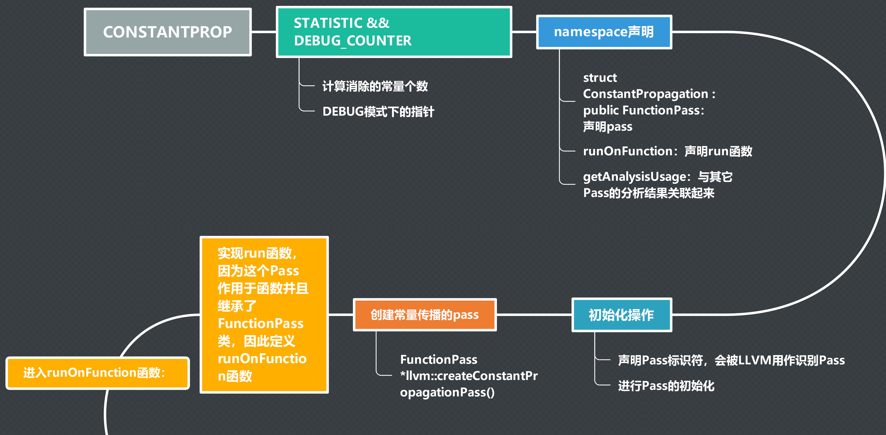
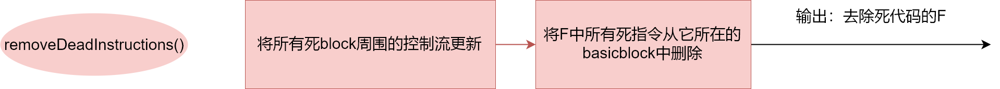

# lab3-2实验报告

小组成员：

孙书情 PB17061266

范睿     PB17111623

王晶     PB17111651

## 实验要求

* 在constprop和dce这两个Pass中中选取一个pass，在adce和tailcallelim这两个Pass中选取一个pass，并介绍该Pass的类型和作用。

* 对于选择的两个pass，通过阅读源码来学习两种pass是如何实现的对`LLVM IR`文件的优化；通过编写测试的`LLVM IR`文件和opt工具来查看优化的效果，对llvm的优化获得进一步的认识。
* 在此基础上学习Pass优化`LLVM IR`代码的方法。

## 报告内容 

**选择的pass：constprop和adce**

### constantprop

#### constantprop的类型和作用

**类型：** transform

**作用：**  此传递实现常量传播和合并。它查找只涉及常量操作数的指令，并用一个常量值代替指令来替换它们。 

#### constantprop优化流程




**说明： ** *上述流程图为`constantprop.cpp`文件的运行流程，为了更清晰地显示图片，故将一张图片截为了上下两部分，所以线条中间有错位情况。下面说明对某一`llvm ir`文件如何进行常量传播的优化*

#####  具体方法说明：

* 在程序后台，即在`constantprop.cpp`代码中会先进行声明Pass的结构体，初始化Pass和其ID等工作，在上述流程图中已详细叙述
* 在`runOnFunction`函数中实现实际的Pass
  * 进行相应的初始化
  * 收集已知的根指令存入`WorkList`中
  * 由于要判断每一条指令中的操作数是否为常量，故需要收集相应的`parent function`的信息，来判断操作数是否可用常数代替
  * 在`while (!Worklist.empty())`循环中，我们基于根指令的活动信息，向后传播活动信息。

* 遍历`WorkList`中每一条指令并判断该指令是否满足优化要求，具体操作方式为：
  * 当该条指令被用到时(即该条指令不是死代码)，进入`ConstantFoldInstruction`函数判断是否为常量
    * 当前的node节点为`phinode`时，判断其后的来自控制流的每一个值是否为常量，进行常量折叠的操作(常量折叠：将常量表达式计算求值，并用求得的值来替换表达式，放入常量表，是一种编译优化。)
    * 当前节点为非`phinode`的其余指令时，分类进行讨论
      * 为赋值指令时，判断操作数是否均为常量，若是进行常量折叠操作
      * 为比较指令时，判断比较的左右两个值是否均为常量，若是，进行常量折叠操作
      * 为load指令时，判断指向的地址是否存储的是常量，若是，进行常量折叠操作
      * 为插入指令(`InsertValueInst：InsertValueInst`向一个聚集类型（struct/class/union或数组）值的一个数据成员插入值，并返回更新后的聚集类型值。)时：若插入表达式为常量，则进行常量折叠操作
      * 为提取值指令时(`ExtractValueInst：ExtractValueInst`从一个聚集类型值的指定域提取值。)时：若提取表达式为常量，则进行常量折叠操作
      * **注：**在遍历每一条指令前均要先用`erase()`函数从`WorkList`中去除该指令，目的是保证每条指令被遍历一次
* 若该条指令的结果即某一变量被下面的指令使用，则将使用该变量的指令`users`均压入新创建的`NewWorkList`中，并把这些指令中的相应变量值替换为对应的常量值，最后用`NewWorkList`替换`WorkList`。

#### 优化样例：

##### 样例1

**常量的trunc指令可以被优化**

```c
define <8 x i8> @test_truc_vec() {
  %x = bitcast <2 x i64> <i64 1, i64 2> to <8 x i16>
  %y = trunc <8 x i16> %x to <8 x i8>
  ret <8 x i8> %y
}
```

优化后：

```powershell
define <8 x i8> @test_truc_vec() {
  ret <8 x i8> <i8 1, i8 0, i8 0, i8 0, i8 2, i8 0, i8 0, i8 0> ;优化后直接返回trunc后的结果
}
```

##### 样例2

**计算结果未定义的话将ret值直接改为undef**

```c
define i32 @test() {
        %R = sdiv i32 -2147483648, -1           ; <i32> [#uses=1]
        ret i32 %R
}
```

优化后：

```c
define i32 @test() {
  ret i32 undef
}
```

* %X由64位的0转换成i32*的null，再return %X的话，优化成ret null

```c
define i32* @test1() {
        %X = inttoptr i64 0 to i32*             
        ret i32* %X
}
```

优化后：

```c
define i32* @test1() {
  ret i32* null
}
```

##### 样例3

**add指令1+2用constprop优化后被跳过，直接将结果存入相应寄存器，`icmp`比较的两个值均为常数，则优化后可直接判断出比较后的结果**

```c
define dso_local i32 @main() #0 {
  %1 = alloca i32, align 4
  %2 = alloca i32, align 4
  %3 = alloca i32, align 4
  %4 = alloca i32, align 4
  %5 = alloca i32, align 4
  %6 = add nsw i32 1,  2
  store i32 %6,i32* %1, align 4     ;1+2->3
  %7 = load i32,i32* %1,align 4
  %8 = icmp ne i32 0, 0		
  br i1 %8, label %true_if, label %false_if ;%6->false

true_if:                         
  store i32 1, i32* %1			
  %9 = load i32, i32* %1		
  ret i32 %9

false_if:                              
  store i32 0, i32* %1			
  %10 = load i32, i32* %1		
  ret i32 %7
}
```

优化后：

```powershell
define dso_local i32 @main() {
  %1 = alloca i32, align 4
  %2 = alloca i32, align 4
  %3 = alloca i32, align 4
  %4 = alloca i32, align 4
  %5 = alloca i32, align 4
  store i32 3, i32* %1, align 4  ;此处省略了1+2的过程，直接将3存入
  %6 = load i32, i32* %1, align 4
  br i1 false, label %true_if, label %false_if  ;此处省略了比较的过程，直接得出判断结果为false
  ;其余部分与优化前相同
```

##### 控制流图

**constantprop.ll控制流图与-constprop优化后的控制流图：constantprop.ll`将所有的constantprop测试样例整合到了同一个文件中**


### adce

#### adce的类型和作用：

**类型：**Transform

**作用：**（激进地）消除死代码。（激进地意思是它假设值在被证明为活的之前是死的） 

#### adce优化流程


__输入：__ 待优化的一个llvm函数F

进入pass的函数是

```c++
bool AggressiveDeadCodeElimination::performDeadCodeElimination() {
  initialize();
  markLiveInstructions();
  return removeDeadInstructions();
}
```

该函数依次执行三个函数，三个函数的作用各有不同。

##### initialize()


初始化做了4件事：

0. 在初始化开始前，adce假设所有basicblock中的语句都__不是__活指令

1. 获取每个basicblock和每个instruction的基本信息

   * 遍历F中的每个block，获取BB的指针、terminator语句指针和terminator是否是无条件跳转等信息

   * 遍历F中的每个block的每条指令I，获取I所在basicblock的指针

2. 将__永远__是活的的那些指令标记为活指令，并将它们加入Worklist

   * 遍历F中每条指令，若该指令永远都是活的(inAlwaysalive()返回1)，将它标记为活指令

   * tip: isAlwaysAlive()的判断：
     1.有副作用的语句永远是活的
     2.terminator、store、call等会写入内存的指令是活的

3. 标记每个basicblock的活性

   * __深度优先__遍历F的每个basicblock，若该BB的terminator语句不是活指令，则查看BB的每一个后继块：若有一个后继块在祖先的活跃栈中，则将该BB的terminator标记为活跃

   * 在__后支配树__上查看，在后支配树的根的孩子的结点中，将terminator不是return语句的所有结点所带领的子树上的__所有__结点的terminator语句标记为活

   * tip1：在标记terminator是活性的时候，会将该terminator所在的basicblock也标记为活的

   * tip2：entry这个基本块一直是活的

4. 收集所有terminator是死代码的blocks到BlocksWithDeadTerminators里

##### markLiveInstructions()


此函数的目的是：由当前已经找到的活指令开始，从后向前找到最多的活指令。

此函数做了1件事情：

0. 刚进来时，worklist中包含所有最新的被mark为live的那些指令（也就是initialize里面被mark为live的指令）
1. 由worklist中的初始指令开始，__找到所有能找到的__新指令，将它们标记为活指令
   * 若弹出worklist一条指令，遍历这条指令的所有操作数，将给这个操作数赋值的指令标记为活指令，若这条指令是一个phi指令，将它标记为phi的活指令，直到worklist为空。
   * 利用控制流的依赖关系来将一些跳转指令标记为活指令：对NewLiveBlocks里的每一个基本块，若它在控制流图中有着非活的前驱，该前驱的terminator标记为活指令
   * 若此时worklist不为空，返回第一步，否则退出  
   * tip：NewLiveBlocks里包含着所有被认为是活的基本块

##### removeDeadInstructions()



此函数的作用是将所有死代码删除。

此函数共做了两件事情：

1. 将所有__死block__周围的控制流更新
   *   遍历BlocksWithDeadTerminators中的所有基本块（所有terminator不是活指令的块），BB：
       * 若该block是以无条件跳转结尾的，将它标记为活的，继续遍历下一个
       * 重新计算该block的后续遍历的序号
       * 在BB的后支配树中的所有结点里，选择后序遍历序号最大的那个后继，它是距离exit最近的结点，为它加上一个无条件跳转来跳过BB，为删除BB做准备。
       * 在控制流图中对所有被删除的边进行更新  
2. 将F中所有死指令从它所在的basicblock中删除
   * 有了上一步，现在就可以将所有死代码直接删除了。
   * 遍历F中所有的死代码，将它们加入Worklist，然后遍历Worklist中的所有指令，将它们从他们所在的basicblock中删除

#### 优化样例

##### 样例1

若调用的函数没有返回值，则调用指令会被删除。

```powershell
declare i32 @strlen(i8*) readonly nounwind

;没有使用call函数的返回值，call指令被删除
define void @test() {
call i32 @strlen( i8* null )
ret void
}
```

↓↓↓ adce

```powershell
declare i32 @strlen(i8*) #0
;call语句被删去
define void @test() {
  ret void
}
```

##### 样例2

```powershell
define dso_local i32 @array() #0 {
  %1 = alloca i32, align 4
  %2 = alloca i32, align 4
  %3 = alloca [3 x i32], align 4
  store i32 0, i32* %1, align 4
  %4 = getelementptr inbounds [3 x i32], [3 x i32]* %3, i64 0, i64 2
  store i32 1, i32* %4, align 4
  ;引用数组后未使用引用后的结果
  %5 = getelementptr inbounds [3 x i32], [3 x i32]* %3, i64 0, i64 2 
  %6 = load i32, i32* %5, align 4
  store i32 1, i32* %2, align 4
  ;load了但没有用
  %7 = load i32, i32* %2, align 4
  %8 = load i32, i32* %2, align 4
  %9 = add nsw i32 %8, 1          
  ret i32 %7
}
```

↓↓↓ adce

```powershell
define dso_local i32 @array() {
  %1 = alloca i32, align 4
  %2 = alloca i32, align 4
  %3 = alloca [3 x i32], align 4
  store i32 0, i32* %1, align 4
  %4 = getelementptr inbounds [3 x i32], [3 x i32]* %3, i64 0, i64 2
  store i32 1, i32* %4, align 4
  ；%5的获取数组地址的指令被删去
  store i32 1, i32* %2, align 4
  ;删去了一个load%2的指令
  %5 = load i32, i32* %2, align 4
  ;由于%9计算后也没有使用，所以也被删去
  ret i32 %5
}
```

##### 样例3

```powershell
define dso_local i32 @main() #0 {
  %1 = alloca i32, align 4
  %2 = alloca i32, align 4
  %3 = alloca i32, align 4  ;变量声明后未使用
  store i32 0, i32* %1, align 4
  store i32 1, i32* %2, align 4
  %4 = load i32, i32* %2, align 4
  %5 = load i32, i32* %2		;将值Load出来未使用
  %6 = load i32, i32* %3		;将值Load出来未使用

  %7 = icmp sgt i32 %4, 0
  br i1 %7, label %8, label %9

; <label>:8:                                      
  store i32 1, i32* %2, align 4
  br label %10

; <label>:9:                                   
  store i32 2, i32* %2, align 4
  br label %10

; <label>:10:                                    
  %11=phi i32[1,%8],[2,%9]      ;使用Phi指令，但结果未被使用
  %12=phi i32[1,%8],[2,%9]
  ret i32 %4
}
```

↓↓↓ adce

```powershell
define dso_local i32 @main() {
  %1 = alloca i32, align 4
  %2 = alloca i32, align 4
  ;多余的变量声明被删去
  store i32 0, i32* %1, align 4
  store i32 1, i32* %2, align 4
  %3 = load i32, i32* %2, align 4
  ;两条load均被删去
  %4 = icmp sgt i32 %3, 0
  br i1 %4, label %5, label %6

; <label>:5:                                      ; preds = %0
  store i32 1, i32* %2, align 4
  br label %7

; <label>:6:                                      ; preds = %0
  store i32 2, i32* %2, align 4
  br label %7

; <label>:7:                                      ; preds = %6, %5
  ;phi指令被删去
  ret i32 %3
}
```

##### 由样例3解释adce如何执行

样例3的CFG图如下：


initialize()之后，一下蓝色的语句被标记为活指令


markLiveInstructions()之后，一下黄色的语句为被新加入活指令，黄色箭头表示推导关系，被指的语句由指的语句找到，被加入活语句集合中。


removeDeadInstructions()之后，没有颜色的语句被删去。

##### 控制流图

**adce.ll控制流图与-adce优化后的控制流图：`adce.ll`将所有的adce测试样例整合到了同一个文件中**


## 实验总结

* 通过本次实验我们初步理解了Pass框架及其子类，阅读了相关的Pass函数的实现代码，对于如何实现一个Pass有了初步了解

* 我们小组通过查阅资料，以及阅读《LLVM cookbook》这本书学习了不同的优化方案，重点学习了我们选择的两个优化方案`constantprop`和`adce`，通过阅读cpp代码知道了这两种方式是如何对`LLVM IR`文件进行优化的，并尽我们的能力把所有想到的优化方案均实现了一遍

* 为了更好地理解Pass的实现方式，我们小组成员一方面画出了两个cpp文件运行的流程图，同时通过借鉴《LLVM cookbook》这本书上的方法自行实现了一个`Function Pass`，代码如下：

  ```cpp
  #include "llvm/IR/Function.h"
  #include "llvm/Pass.h"
  #include "llvm/Support/raw_ostream.h"
   
  using namespace llvm;
   
  #define DEBUG_TYPE "hello"
   
  namespace {
    // Hello - The first implementation, without getAnalysisUsage.
    struct MyHello : public FunctionPass {
      static char ID; // Pass identification, replacement for typeid
      MyHello() : FunctionPass(ID) {}
   
      bool runOnFunction(Function &F) override {
        errs() << "Hello: ";
        errs() << F.getName() << '\n';
        return false;
      }
    };
  }
   
  char MyHello::ID = 0;
  // myhello 为终端命令的参数
  static RegisterPass<MyHello> X("myhello", "Hello World Pass");
  ```

  * 运行方式：

    ```
    1.在llvm/lib/Transform/下新建文件夹MyHello
    2.并且修改Transform/下的CMakeLists。txt文件末尾新加一句话add_subdirectory(MyHello)
    3.在llvm-build/下执行make指令，在llvm-build/lib/下将会看到新生成的LLVMMyHello.so文件。
    4.编写一个正确的test.ll文件，如下图，我使用adce.ll文件，对此文件进行LLVMMyHello Pass操作，操作命令为：在adce.ll文件的当前目录下执行opt -load ~/LLVM/llvm-build/lib/LLVMMyMyHello.so -myhello adce.ll其中~/LLVM/llvm-build/lib/LLVMMyMyHello.so 为llvm的安装配置路径，注意修改即可。
    ```

  * 运行结果

    

  * `Function Pass`的用途：用于遍历指定的`.ll`文件中的每个函数，执行最简单的`visit`函数。

## 实验反馈

​       本次实验在实现过程中，感到实验要求还是存在一些不明晰的地方，如优化要优化到什么程度，写流程图是结合llvm ir代码说明还是直接就cpp文件进行说明？这些问题使得我们在完成时费了很多不必要的周折，希望下次实验要求能够更加细化一些，同时也感谢助教编写实验时的辛苦付出！
