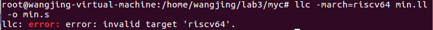
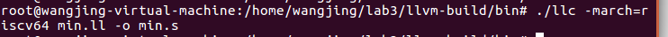
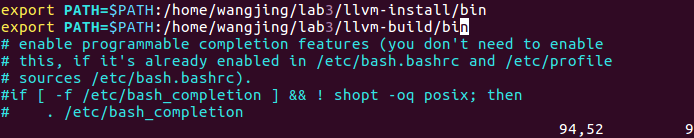
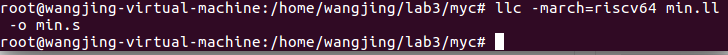
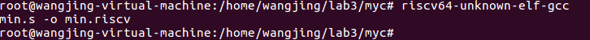
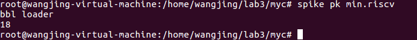
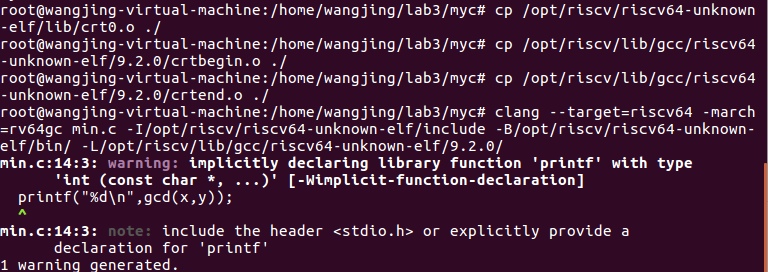
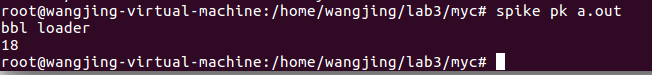

lab4实验报告

| 组长 | 孙书情 | PB17061266 |
| ---- | ------ | ---------- |
| 组员 | 范睿   | PB17111623 |
| 组员 | 王晶   | PB17111651 |


## 实验要求

* 配置LLVM 8.0.1使其支撑RISC-V后端
* 将c文件生成RISC-V源码
* 安装Spike RISC-V模拟器运行RISC-V源码
* 阅读LLVM源码中 RegAllocFast.cpp 代码段理解几个重要函数的执行流程、扫描过程及功能，理解其中关于寄存器选择和分配的方式
* 阅读龙书 Code Generation 一章中关于寄存器选择和分配的内容，分析总结书上所讲的算法与LLVM源码中的实现之间的不同点，并进行解释

## 报告内容

### 1. RISC-V 机器代码的生成和运行
- LLVM 8.0.1适配RISC-V

  ​        由于我在做lab3-0 时在 `build` 文件夹下已编译好 LLVM，使用新的 cmake 命令不会覆盖已有的编译选项，只是添加了额外的编译选项，因此可以直接（保留 Release 配置）进行增量编译。直接进入`llvm- build`文件夹下，运行

  ```
  cmake -DLLVM_EXPERIMENTAL_TARGETS_TO_BUILD=RISCV -DLLVM_TARGETS_TO_BUILD=X86 ../llvm
  make -j2
  ```

- lab3-0 GCD样例 LLVM IR 生成 RISC-V源码的过程

  * 先使用clang和llc来对编译程序生成汇编

    ```
    clang -emit-llvm --target=riscv64 -march=rv64gc min.c -S -o min.ll  -I/opt/riscv/riscv64-unknown-elf/include
    llc -march=riscv64 min.ll -o min.s
    ```

    其中min.c文件使用的是助教提供的GCD样例，但为了能看出最后的结果，将`return`语句改为了`printf`语句，同时增加`return 0;`这行代码，增加了`printf`语句后会产生`warning`警告信息，但不影响后续指令的执行。

    **注：**直接运行`llc -march=riscv64 min.ll -o min.s`会产生报错：

    

    在`llvm-build/bin`下执行：

    

    则可以正常运行，说明`llc` 的环境变量配置有问题，在之前的实验中`llc`的环境变量配置在了`llvm-install`下，但本次实验中适配RISCV时将其配置在了`llvm-build`下，所以应当添加环境变量`export PATH=$PATH:/home/wangjing/lab3/llvm-build/bin`

    

    从而解决了该报错。

    

  * 安装`riscv-gnu-toolchain`:

    为了运行`riscv64-unknown-elf-gcc`指令，需要先编译安装`riscv-gnu-toolchain`源代码，我直接下载了`issues#259`上同学提供的压缩包，具体的编译流程如下：

    ```bash
    # 下载
    $ wget http://210.45.114.30/PB17121687/store/raw/master/riscv-gnu-toolchain-no-git.tar.xz # 大约 250 MB
    # 解压
    $ tar xf riscv-gnu-toolchain-no-git.tar.xz # 解压后大约 2.2G
    $ cd riscv-gnu-toolchain-no-git
    $ sudo apt install autoconf automake autotools-dev curl libmpc-dev libmpfr-dev libgmp-dev gawk build-essential bison flex texinfo gperf libtool patchutils bc zlib1g-dev libexpat-dev
    $ ./configure --prefix=/opt/riscv --with-abi=lp64
    $ sudo make -j2
    # 完成之后在 .bashrc 中加入 RISCV 环境变量
    $ echo 'export RISCV=/opt/riscv' >> ~/.bashrc
    $ echo 'export PATH=$PATH:$RISCV/bin'  >> ~/.bashrc
    $ source ~/.bashrc
    # 这时 riscv64-unknown-elf-gcc 命令即可用
    ```

    然后对于生成的汇编，可以使用riscv版的gcc来生成执行程序：

    

- 安装 Spike模拟器并运行上述生成的RISC-V源码

  * 参考Spike的github文档，安装Spike模拟器
  
    * 下载`riscv-isa-sim-master`压缩包
  
    * 根据`github`上提供的`Build Steps`指令来进行编译安装
  
      ```bash
      $ apt-get install device-tree-compiler
      $ mkdir build
      $ cd build
      $ ../configure --prefix=$RISCV
      $ make
      $ [sudo] make install
      ```
  
      **注：**当编译安装 `riscv-gnu-toolchain` 和` riscv-ism-sim `之后，`spike` 命令已经可用，但执行 `spike pk xxx` 仍然会出现问题:
  
      ```c
      erminate called after throwing an instance of 'std::runtime_error'
        what():  could not open pk (did you misspell it? If VCS, did you forget +permissive/+permissive-off?)
      ```
  
      这是因为 `pk` 仍然没有安装，还需要编译 `riscv-pk`。
  
    * 编译安装`riscv-pk`：参考`github`上`riscv-pk`(https://github.com/riscv/riscv-pk)教程进行编译安装
  
      * 下载`riscv-pk-master`压缩包
  
      * 根据`github`上提供的`Build Steps`指令来进行编译安装
  
        ```bash
        $ mkdir build
        $ cd build
        $ ../configure --prefix=$RISCV --host=riscv64-unknown-elf
        $ make
        $ make install
        ```
  
        现在就可以执行`spike pk xxx` 指令了！
  
    * 通过spike来模拟执行
  
      
  
      助教提供的`gcd`代码的运行结果即为18，说明模拟运行结果正确。
  
- 直接使用clang来生成可执行文件：

  * 将crt0.o, crtbegin.o, crtend.o拷贝到当前目录:

    ```bash
    cp /opt/riscv/riscv64-unknown-elf/lib/crt0.o ./
    cp /opt/riscv/lib/gcc/riscv64-unknown-elf/9.2.0/crtbegin.o ./
    cp /opt/riscv/lib/gcc/riscv64-unknown-elf/9.2.0/crtend.o ./
    ```

    **注：**将助教给出的命令中的`riscv32` 全部替换成 `riscv64`,` 8.3.0` 这个 GCC 版本号全部替换成 `9.2.0`

  * 使用clang编译c文件:

    ```bash
    clang --target=riscv64 -march=rv64gc min.c -I/opt/riscv/riscv64-unknown-elf/include -B/opt/riscv/riscv64-unknown-elf/bin/ -L/opt/riscv/lib/gcc/riscv64-unknown-elf/8.3.0/
    ```

    

  * 通过spike来模拟执行生成的`a.out`文件:

    

    运行结果仍为18，说明模拟运行结果正确。


### 2. LLVM源码阅读与理解

#### 2.1.RegAllocFast.cpp 中的几个问题

-----------------------------------------------------------------------------------------------------------------------------------------------------------

#####  ***2.1.1.RegAllocFast* 函数的执行流程？**


`RegAllocFast`的入口函数是`runOnMachineFunction`，传入的参数是一个函数指针$F$。

`runOnMachineFunction`会首先遍历F中所有的基本块，对每个基本块$MBB$调用`allocateBasicBlock`，依次对每一个基本块分配寄存器。


在`allocateBasicBlock`中，函数又会遍历$MBB$中的每一条指令$MI$，对此块中的每一条指令调用`allocateInstruction`，即依次为每一条指令分配寄存器。`allocateInstruction`这个方法中是`RegAllocFast`中最重要的部分。


首先介绍一下`RegAllocFast`对于寄存器的分类：

**按照类型分类**，寄存器可被分为两类：

* **Physical Register（物理寄存器）** ，电脑中真实存在的寄存器，数量有限。
* **Virtual Register（虚拟寄存器）** ，中间代码中，用于存放中间结果等值的寄存器，可能不与源变量一一对应，可能也不与物理寄存器一一对应，翻译成机器代码时需要被物理寄存器取代的寄存器，数量无限。

从上面的定义可以看出，我们需要建立一个map，保存此时刻的一些虚拟寄存器和一些物理寄存器的对应关系，在`RegAllocFast`中，`PhysRegState`可以被用来从`physreg`找到它对应的`virtreg`，`LiveVirtRegs`可以被用来从`virtreg`找到它对应的`physreg`。

**按照在指令中的位置分类**，寄存器也是可以被分为两类：

* **def（定义）**，即等号左边，被赋值的寄存器
* **use（引用）**，等号右边，需要被读值的寄存器

> 这两种类型可以交叉，即一个寄存器可以既是physreg又是def（被赋值的物理寄存器），可以既是physreg又是use（被读值的寄存器），可以既是virtreg又是def（被赋值的虚拟寄存器），也可以既是virtreg又是use（被读值的虚拟寄存器）。

针对上面四种属性的寄存器，`allocateInstruction`中进行了四次操作数扫描，（详细介绍在下一个问题答案中）。四次扫描依次处理**既是physreg又是use**的寄存器、**既是virtreg又是use**的寄存器、**既是physreg又是def**的寄存器、**既是virtreg又是def**的寄存器。对于物理寄存器，我们不需要为他们分配新的物理寄存器，我们只需要改变它们的状态以便后面使用，对于虚拟寄存器，我们需要通过寄存器选择算法为他们选择一个合适的物理寄存器进行分配。

四次扫描完成后，对这条指令中所有属性的寄存器的处理也已经完成，后面还有一些收尾工作，比如删除一些无用的def，合并一些copy指令都不是主要。

---------------------------------------------

##### ***2.1.2.allocateInstruction* 函数有几次扫描过程以及每一次扫描的功能？**

###### I.总体概述：

0. 在扫描开始之前，我们需要先对copy指令进行一些处理。
   我们需要将copy指令等号左右两边的寄存器标记下来，以便于在后面分配寄存器的时候**直接将形如$x=y$的copy指令中$R_x$赋值成$R_y$**。
1. 第一遍扫描主要处理**既是physreg又是use**的寄存器
   * 因为已经是物理寄存器了，所以不需要对它关联别的物理寄存器
   * 不过需要更改这个物理寄存器的状态：我们将它的状态改成regFree，即空闲的，并且设置一个标志位，标志这条指令对这个物理寄存器的引用是整个程序中最后一次，即将它kill掉。这样他就可以作为一个新的寄存器，分配给别的虚拟寄存器。
2. 第二遍扫描主要处理**既是virtreg又是use**的寄存器
   * 这里需要考虑两种情况，即此虚拟寄存器是否已经被关联到了一个物理寄存器
     * 若没有被关联物理寄存器，那么我们需要通过寄存器选择算法来选择一个合适的物理寄存器，然后与之关联
     * 若已经被关联到了物理寄存器，那么直接使用这个物理寄存器就可以
3. 第三遍扫描主要处理**既是physreg又是def**的寄存器
   * 因为已经是物理寄存器了，所以不需要对它关联别的物理寄存器
   * 不过需要更改这个物理寄存器的状态以便后面对它的使用
4. 第四遍扫描主要处理**既是virtreg又是def**的寄存器
   * 这里也是需要考虑两种情况，即是否已有物理寄存器关联
     * 若没有被关联物理寄存器，对copy指令做特殊处理后再用寄存器选择算法选择合适的物理寄存器，然后与之关联
     * 若已经被关联到了物理寄存器，那么直接使用这个物理寄存器就可以

###### 2.细节化描述：

0. 初始化：

   - `copy`：考虑copy指令，新设相关变量，初始化为0，若当前指令为`copy`指令时，将新设变量与指令操作数相关联。
   - `UsedInInstr`：clear操作。跟踪记录在当前机器指令下需要被使用的物理寄存器。
   
1. `First Scan:`

   1. 初始化新设变量
   2. 遍历每个操作数，设当前操作数为MO
   
   - RegMask：执行相应的函数。
   
   - 考虑`reg` = `virtreg`:
   
     - 更新虚拟寄存器操作数结束符，`VirtOpEnd = i+1;`其中i为当前遍历的操作数编号。
        - 若此操作数MO是`use`状态：考虑此操作数是否同时被def，更新`hasTiedOps`布尔常量。
        - 若此操作数MO是`def`状态：根据MO的自身信息，更新`hasEarlyClobber`和`hasPartialRedefs`
   
   - 考虑`reg`= `physreg `
   
     - 若 `& 此操作数MO处于use状态 `：更新`UsedInInstr`，将该`physreg`插入`UsedInInstr`
        - 若``& 此操作数MO处于def状态 ``
          - 若此MO先前被`clobbered`：根据`MO.isImplicit() || MO.isDead()`来重新更新该`physreg`的`newstate`
          - 若此MO先前未被`clobberd`：则说明此此指令是对该物理寄存器的`def`，将`hasPhysDefs`置为`true`
   
    3. 对特殊指令进行特殊处理：
   
2. `Second Scan:`
  
   1. 遍历每个可能存在于虚拟寄存器的操作数，MO为当前操作数。
      - 该操作数存储于`virtreg`并且处于`use`状态且之前曾经被`def`：
         - `mayLiveIn(Reg):`填充MayLiveAcrossBlocks，以防在def块之前分配use块(删除vreg使用)。
         - `reloadVirtReg` ：修改虚拟寄存器与物理寄存器之间的映射图。假使当前的虚拟寄存器并没有在map中，调用`allocVirtReg`函数得到最合适的物理寄存器，并调用`reload`函数将物理寄存器中的值更新。最后更新一下`UsedInInstr`map。    
         - 考虑`copy`指令：更新`copySrcReg`
         - 分析该指令是否会kill当前MO被分配物理寄存器，`setPhysReg(MI, MO, PhysReg) Return true if the operand kills its register.`因此若当前指令会kill掉MO所分配的物理寄存器，则将该`physreg`关联的`virtreg`设置为`available`不能再被使用。
         
      - 对于`undef`的操作数，执行关于`undef`操作数的`alloc`
      
   4. 处理`UsedInstr`：初始清空。
   
      - 当该指令有操作数为early clobbered,遍历该指令的操作数，对于操作数存储在`physReg`并且满足以下条件中至少为一个：该操作数为`Def`；该操作数为`isTied`。将该`physreg`标记，插入`UsedInstr`
   5. 考虑当前指令类型：若是`call`指令，则spill掉所有需要spill的虚拟寄存器，重新建立被调用函数虚拟寄存器到物理寄存器的映射图。
   
3. `Third Scan:` 
  
  1. 遍历所有的def操作数。MO为当前操作数。
     - 若该操作数在可分配的物理寄存器中，对该`physreg`的进行新状态的设置。
  
4. `Fourth Scan:` 
  
  - . 遍历所有def操作数.
       - 若该操作数在虚拟寄存器中，修改映射关系map，将该虚拟寄存器与一个物理寄存器相关联。
       - 对于`copy`指令另加操作，更新`copy`变量。
  - 删除所有的`dead defs`。
  

-----------------------------------------

##### ***2.1.3.calcSpillCost* 函数的执行流程？**

`unsigned RegAllocFast::calcSpillCost(MCPhysReg PhysReg)`:**返回传入的physreg的spillcost。**


执行流程主要分为两大类：

1. 对于在该指令中需要被使用的`physreg`(`isRegUsedInInstr(PhysReg) = True`)此种情况下该物理寄存器是不可以被spill掉的，函数返回`spillImpossible`.
2. 对于未在此指令中使用的物理寄存器(`isRegUsedInInstr(PhysReg) = False`），根据寄存器的状态`PhysRegState[PhysReg]`进行讨论：
   - `regFree`：返回`cost=0`这说明该寄存器可以直接被分配。
   - `regReserved`：返回`cost=spillImpossible`，说明该寄存器已经被提前预定了，不可以被临时使用。
   - `虚拟寄存器`：说明该物理寄存器关联一个虚拟寄存器，则只需将该虚拟寄存器中值spill掉即可。考虑虚拟寄存器的状态，返回`spillDirty`或`spillClean`
   - `regDisabled`：累加每个`alias`的`spillcost`，根据每个`alias`的状态可以得到对应别名的cost
     - `regFree`: cost = 0 
     - `regReserved`：cost=`spillImpossible`
     - `regDisabled`：cost+=1
     - 虚拟寄存器：cost+=`spillDirty` or `spillClean`

-------------------------------------

##### **2.1.4.`hasTiedOps`，`hasPartialRedefs`，`hasEarlyClobbers` 变量的作用？**

* `hasTiedOps = true`：多个变量值相同并使用同一个寄存器，即我们认为他们是绑定在一起的变量。当对其中一个变量进行重新def时，则需要解绑定，再考虑对目标变量重新赋值，而不应该在未解绑定时就def。
* `hasPartialRedefs`：标志指令中是否有`目的操作数=源操作数`的情况（有=true，无=false）
* `hasEarlyClobbers`：指令中的`def`寄存器是否在完全读完所有的`use`寄存器的时候就被赋值了。在一般情况下，我们假设每一个处于`def`的输出寄存器都会在读完该指令相关的所有`use`输入寄存器后，才被赋值，若假设成立，我们便可以对输入寄存器与输出寄存器使用同一个寄存器。但是当假设不成立时，譬如在内联汇编某些情况下，我们令处于`def`状态的输出寄存器在未读完所有的`use`输入寄存器之前就要被赋值，此时我们设置`hasEarlyClobbers = true`，这提醒着编译器在此时进行寄存器分配时，`def`输出寄存器不可以与`use`输入寄存器使用同一个寄存器。

#### 2.2.书上所讲的算法与LLVM源码中的实现之间的不同点

##### 书上算法图：


##### 书上算法和LLVM源码中对于**copy指令的处理**有所不同。

--------------------------------

**Copy指令的含义：**

形如
$$
x=y
$$
的指令，直接将右边的变量值赋值给左边，没有任何运算。

**书上实现方式：**

遇到了复制指令，先安装正常方法对$y$变量选择寄存器$R_y$，然后直接令$R_x=R_y$。

**LLVM源码中的实现：**

LLVM源码中给virtual registers分配physical register的方法（不论这个virtual register是use还是def）都有可能是`allocVirtReg`。

这个方法的参数有

```c++
void RegAllocFast::allocVirtReg(MachineInstr &MI, LiveReg &LR, unsigned Hint0)
```

* `MI`是这个`virtreg`所在的指令
* `LR`指向这个`virtreg`的信息
* `Hint0`根据`virtreg`的不同有所不同：
  * 如果`virtreg`是`use`，`Hint0`是`CopyDstReg`
  * 如果`virtreg`是`def`，`Hint0`是`CopySrcReg`
  * 不管怎样，`virtreg`都是Copy指令中与`virtreg`在等号的不同边的寄存器

-------------------------------

对于`virtreg`的`use`指令的分配有所不同。

现在假设遇到了一个Copy指令，且这条指令：

* 等号右边的操作数是`virtreg`，且没有被分配任何物理寄存器。
* 等号左边的操作数是`physreg`。

因此在第一次扫描之前：

```c++
if (MI.isCopy()) {
    CopyDstReg = MI.getOperand(0).getReg();
    CopySrcReg = MI.getOperand(1).getReg();
    CopyDstSub = MI.getOperand(0).getSubReg();
    CopySrcSub = MI.getOperand(1).getSubReg();
  }
```

`CopyDstReg`会被置为被赋值的寄存器（`physreg`），`CopySrcReg`会被置为赋值的寄存器（`virtreg`）。

在扫描过程中，这条Copy指令会先进入第二次扫描，即等号右边的操作数会先被分配一个物理寄存器，进入`reloadVirtReg`方法。其中`Hint = CopyDstReg`。

然后，由于假设中此Copy指令没有被分配任何物理寄存器，此方法中最开始的判断一定会成立。

```c++
if (!LRI->PhysReg) {
    allocVirtReg(MI, *LRI, Hint);
    reload(MI, VirtReg, LRI->PhysReg);
  }
```

进入`allocVirtReg`，其中`Hint0=CopyDstReg`。

在`allocVirtReg`中，会首先执行以下判断：

```c++
if (此时Hint0被分配给LR是合适的)
    unsigned Cost = calcSpillCost(Hint0);//算一下spill Hint0的话代价多少
    if (代价很小) {
      if (Cost)
        definePhysReg(MI, Hint0, regFree);
      assignVirtToPhysReg(LR, Hint0);
      return;
    } 
  } else {
    Hint0 = 0;
}
```

如果此时`Hint0`恰好是一个空闲的寄存器，即spill的代价为0，那么直接将`Hint0`，即Copy左边的物理寄存器与右边的虚拟寄存器相关联。此时根本没有对此`virtreg`按照*寄存器分配算法*进行分析就已经得到了`virtreg`的`physreg`，而按照书上的代码，对于`virtreg`的分配一定要先走一遍*寄存器分配算法*。此处有所不同。

--------------------------

相应的，对于`def`的`virtreg`的分配也有不同：

若此Copy指令的目标寄存器是`virtreg`且此`virtreg`没有被关联`physreg`，源寄存器是也是`virtreg`，一开始`CopySrcReg`会被置为源寄存器（`virtreg`）。

在第四次循环中，进入`defineVirtReg`，其中`Hint=CopySrcReg`，会先执行以下判断：

```c++
if (!LRI->PhysReg) {
    if (Hint不是物理寄存器 || ...) {
      const MachineInstr &UseMI = 这个Virtreg的第一个use指令
      if (如果UseMI是一个类似于Copy的指令)
        Hint = UseMI.getOperand(0).getReg();//就把Hint置为这条指令的目的寄存器
    }
    allocVirtReg(MI, *LRI, Hint);
  }
```

从以上代码可以看出，LLVM并不是直接判断这条是不是Copy，如果是就直接分配，不是再按照正常算法找；而是非常复杂的过程：

* 如果指令是Copy，那么就直接用指令的源操作数或源操作数找到的`physreg`
* 如果指令不是Copy，那么先在下面的指令里找一找有没有将此Copy指令的目的寄存器用作源操作数的Copy或者类似于Copy的指令，如果有，就直接将那条指令的目的寄存器用作Copy指令的目的`virtreg`候选物理寄存器，然后再用正常算法选择。

------------------------------

其实说到这里，书上算法和LLVM的算法的区别已经很明晰了，其实在LLVM实现和书上算法类似的过程之前，它又加入了一些判断，比如它查看了曾经是否有一系列连续的Copy语句的赋值，尝试能否通过copy序列找到最原始的`physreg`，不过在这里就不细说了。

--------------------

**为什么要有这样的不同**

LLVM之所以做出这些改变，是因为这些“额外”的判断能更多的节省寄存器的数量或者更快地找到合适的寄存器。由于Copy指令的特殊性，LLVM希望充分地利用Copy带来的便利，能将更多的相同值的变量的寄存器组合到一起，在提高代码效率的同时节省更多的资源，为计算机带来更多的可能性。


**## 组内讨论内容**

第一次讨论：12.14

内容：分配任务

第二次讨论：12.18

内容：配环境，开始初步读代码，交流疑问

第三次讨论：12.20

内容：深入理解龙书算法和代码，渐渐读懂第1-3遍scan在做什么

第四次讨论：12.21

内容：读完第4遍scan，完成报告


## 实验总结

在本次试验中，我们学会了：

* 用llvm生成risc-v的可执行文件，并用risc-v的模拟器spike运行
* 龙书对于寄存器分配的具体过成
* llvm对于寄存器分配的具体过程，感受到了算法与实现的巨大差别。

虽然阅读代码的过程十分令人头秃，但是通过不断比对和人工模拟执行代码，我们终于发现了方法与方法之间的联系，多少破解了一点llvm的“密码”。虽然对寄存器执行的每一个细节还不完全掌握，但是大致流程我们已经非常熟悉。有了学习llvm源码的过程，我们对寄存器分配的理解更深了一步。


## 实验反馈

1. 阅读源码很吃力，希望助教以后可以适当的提供些参考资料或例子或提示。

