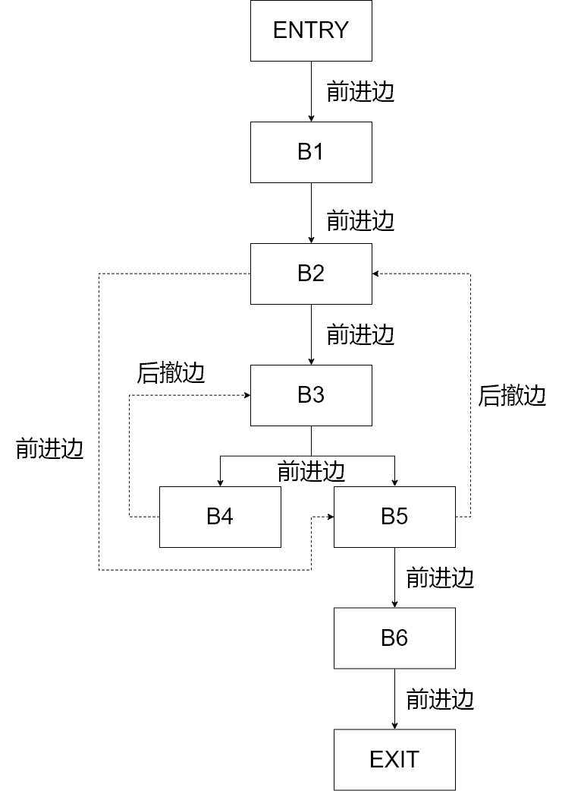

# HW13

范睿

PB17111623

## 9.3 c

|      | use     | def  | IN            | OUT           |
| ---- | ------- | ---- | ------------- | ------------- |
| B1   | ∅       | a, b | e             | a, b, e       |
| B2   | a, b    | c, d | a, b, e       | a, b, c, d, e |
| B3   | b, d    | ∅    | a, b, c, d, e | a, b, c, d, e |
| B4   | a, b, e | d    | a, b, c, e    | a, b, c, d, e |
| B5   | a, b, e | e    | a, b, c, d    | a, b, d, e    |
| B6   | b, d    | a    | b, d          | ∅             |

## 9.15

### a

D(B1)={ENTRY, B1}

D(B2)={ENTRY, B1, B2}

D(B3)={ENTRY, B1, B2, B3}

D(B4)={ENTRY, B1, B2, B3, B4}

D(B5)={ENTRY, B1, B2, B5}

D(B6)={ENTRY, B1, B2, B5, B6}

### b, c

ENTRY->B1->B2->B3->B5->B6->B4->EXIT

### d

该流图可归约，因为在任何深度优先生成树上，后撤边都是回边。

### e

该流图深度为1

### f

由B5->B2确定的自然循环是{B2, B3, B5, B4}

有B4->B3确定的自然循环是{B3, B4}