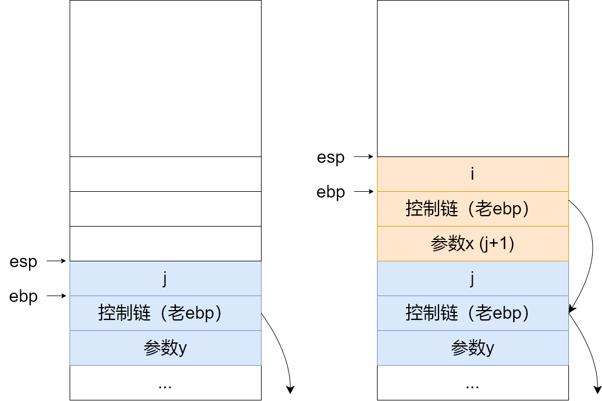
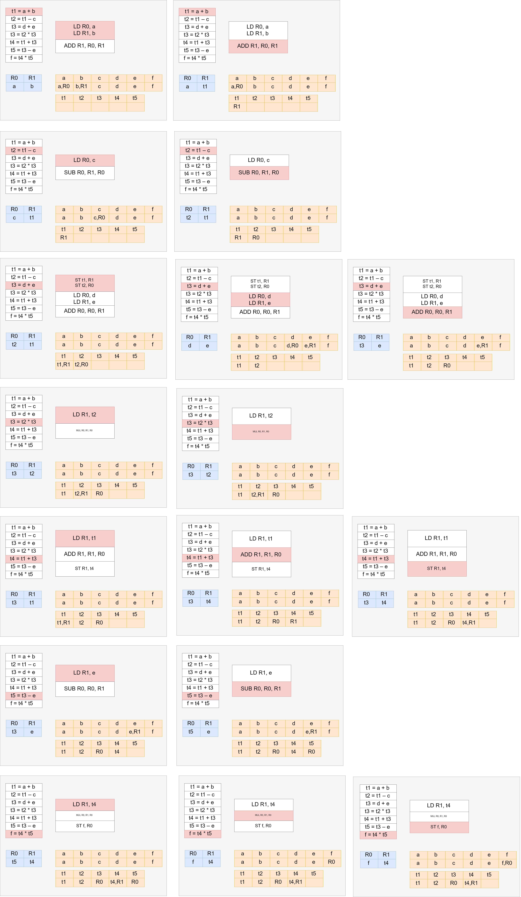
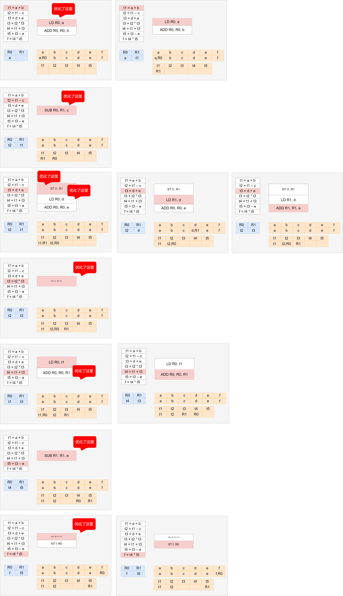

# HW 14

PB17111623

范睿

## 6.6

## 6.10

因为main在调用func时，将传递的参数反向依次压入栈中，也就是，先压i3，再压i2，再压i1，由于栈的增长是从高地址向低地址增长，因此i1的地址最小，i3的地址最大；

又因为func在定义内部的局部变量时，是按照定义的顺序压入栈中，也就是，先压 j1，再压j2，再压j3，还是由于栈的增长是从高地址向低地址增长，因此j3的地址最小，j1的地址最大。

## 6.13

### a

因为传参数时反向压栈，5在最上面，15在最下面，当fact在寻找参数i的时候，i是fact的第一个参数，因此通过epb找到第一个参数5后直接使用，而不是取到下面的10到15。因此fact在算的时候还是用5来算的。

### b

5.0在计算机中的存储为0 1000 0001 0100 0000 0000 0000 0000 000，在5.0被push到栈上时，小数部分在地址低位，当fact在寻找参数i时，会找到地址最低（栈中最高）的 位置的一个字节的数据，即0，所以fact会返回1

### c

因为fact在寻找参数时，会找到main函数里面的位置，这是不允许出现的事情，fact不能通过这样的方式访问main中的数据，所以会报错。

## ppt题

### a

| 中间代码     | 机器代码                                   |
| ------------ | ------------------------------------------ |
| t1 = a + b   | LD R1, a LD R2, b ADD R1, R1, R2 |
| t2 = t1 - c  | LD R2, c SUB R2, R1, R2               |
| t3 = d + e   | LD R3, d LD R4, e ADD R3, R3, R4 |
| t3 = t2 * t3 | MUL R3, R2, R3                             |
| t4 = t1 + t3 | ADD R5, R1, R3                             |
| t5 = t3 - e  | SUB R6, R3, R4                             |
| f = t4 * t5  | MUL R5, R5, R6 ST f, R5               |

### b

### c

总代价=(2+2+1)+(2+1)+(2+2+2+2+1)+(2+1)+(2+1+2)+(2+1)+(2+1+2)=5+3+9+3+5+3+5=33

优化：

优化后的总代价=(2+2)+(2)+(2+2+2)+(1)+(2+1)+(2)+(1+2)=4+2+6+1+3+2+3=21

