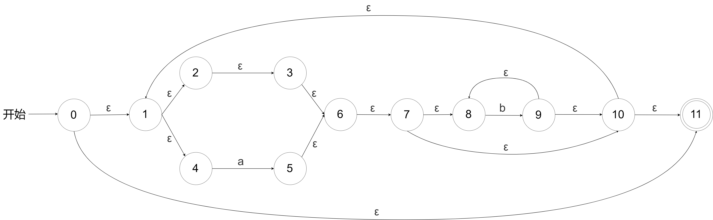
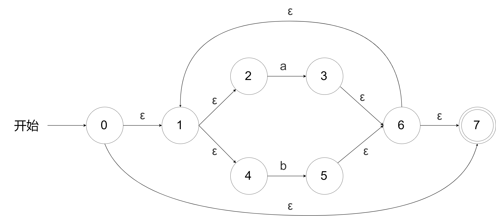
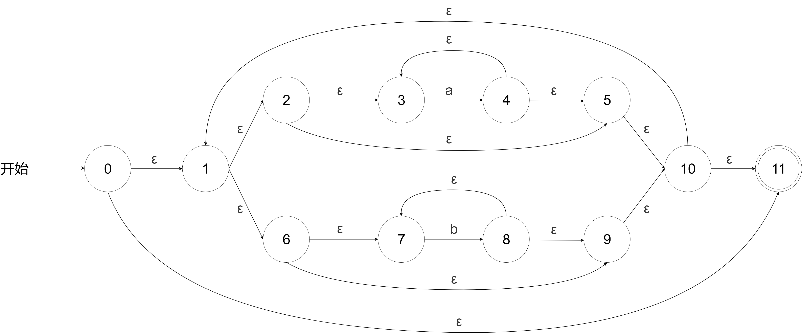
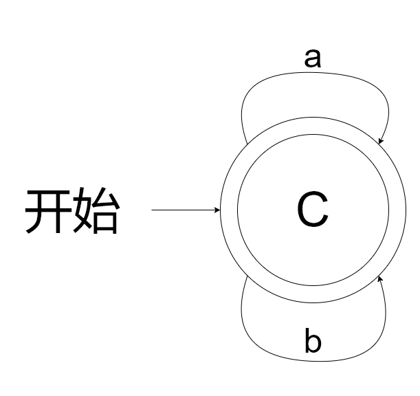
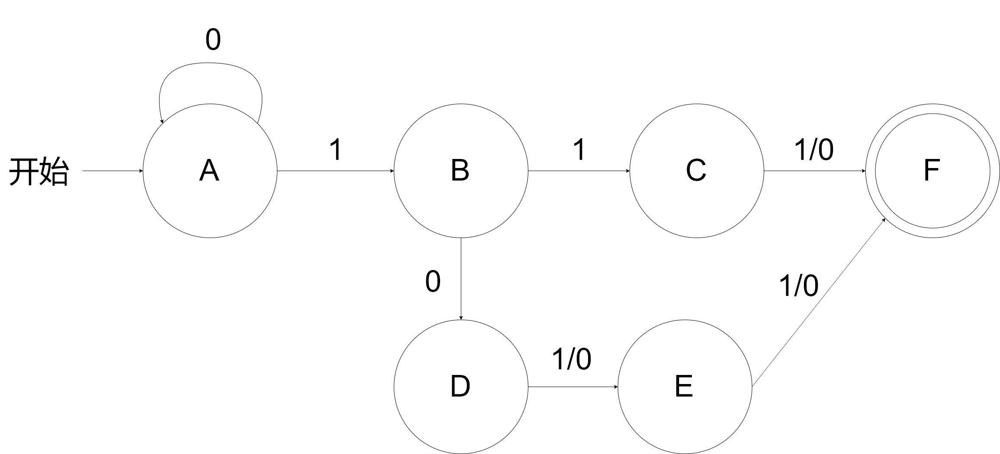
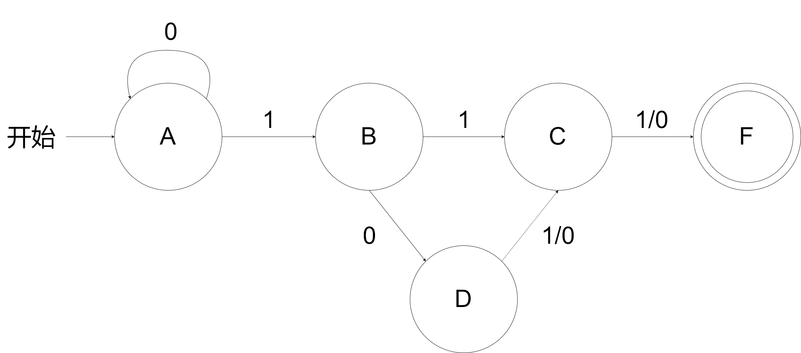

# 第二周作业

## PB17111623 范睿

## 2.1 e

SQL字符集为utf8

## 2.2

<__id__, 指向符号表中long条目的指针>

<__id__, 指向符号表中gcd条目的指针>

<__id__, 指向符号表中long条目的指针>

<__id__, 指向符号表中p条目的指针>

<__id__, 指向符号表中long条目的指针>

<__id__, 指向符号表中q条目的指针>

<__if__>

<__id__, 指向符号表中p条目的指针>

<__mod_op__>

<__id__, 指向符号表中q条目的指针>

<__relation__, ==>

<__number__, 整数0>

<__id__, 指向符号表中return条目的指针>

<__id__, 指向符号表中q条目的指针>

<__else__>

<__id__, 指向符号表中return条目的指针>

<__id__, 指向符号表中gcd条目的指针>

<__id__, 指向符号表中q条目的指针>

<__id__, 指向符号表中p条目的指针>

<__mod_op__>

<__id__, 指向符号表中q条目的指针>

## 2.3 e

带有偶数个0和偶数个1的符号串全体

## 2.4 

### a

令所有非元音的集合为F

(F|ε)* a (F|ε)* e (F|ε)* i (F|ε)* o (F|ε)* u (F|ε)* 

### f

(00|11)* ((01|10)(00|11)* (01|10)(00|11)* )*

### i

((b+(a|ε))* )|b*

## 2.7 c

ababbab:

0→1→4→5(a)→6→7→8→9(b)→10→1→4→5(a)→6→7→8→9(b)→8→9(b)→10→1→4→5(a)→6→7→8→9(b)→10→11

## 2.11

### (a|b)*

NFA:

A = {0, 1, 2, 4, 7}

* B = ε-closure(move(A, a)) = ε-closure({3}) = {3, 6, 1, 2, 4, 7}
  * ∴ Dtrans[A, a] = B

* C = ε-closure(move(A, b)) = ε-closure({5}) = {5, 6, 7, 1, 2, 4}
  * ∴ Dtrans[A, b] = C

* ε-closure(move(B, a)) = ε-closure({3})
  * ∴ Dtrans[B, a] = B

* ε-closure(move(B, b)) = ε-closure({5})
  * ∴ Dtrans[B, b] = C

- ε-closure(move(C, a)) = ε-closure({3})
  - ∴ Dtrans[C, a] = B

- ε-closure(move(C, b)) = ε-closure({5})
  - ∴ Dtrans[C, b] = C

转换表

|      |  a   |  b   |
| :--: | :--: | :--: |
|  A   |  B   |  C   |
|  B   |  B   |  C   |
|  C   |  B   |  C   |

### (a* |b* )*

A = {0, 1, 2, 3, 5, 6, 7, 9, 10, 11}

* B =  ε-closure(move(A, a)) = ε-closure({4})  = {4, 3, 5, 10, 1, 2, 6, 7, 9, 11}
  * ∴ Dtrans[A, a] = B
* C =  ε-closure(move(A, b)) = ε-closure({8})  = {8, 7, 9, 10, 1, 6, 2, 3, 5, 11}
  * ∴ Dtrans[A, b] = C
* ε-closure(move(B, a)) = ε-closure({4})  
  - ∴ Dtrans[B, a] = B
* ε-closure(move(B, b)) = ε-closure({8})
  - ∴ Dtrans[B, b] = C
* ε-closure(move(C, a)) = ε-closure({4})  
  - ∴ Dtrans[C, a] = B
* ε-closure(move(C, b)) = ε-closure({8})
  - ∴ Dtrans[C, b] = C

转换表

|      |  a   |  b   |
| :--: | :--: | :--: |
|  A   |  B   |  C   |
|  B   |  B   |  C   |
|  C   |  B   |  C   |

### ((ε|a)b* )*

A = {0, 1, 2, 3, 6, 4, 7, 8, 10, 11}

* B =  ε-closure(move(A, a)) = ε-closure({5})  = {5, 6, 7, 8, 10, 1, 2, 3, 4, 11}

  * ∴ Dtrans[A, a] = B
* C =  ε-closure(move(A, b)) = ε-closure({9})  = {9, 8, 10, 11, 1, 2, 3, 6, 4, 7}

  * ∴ Dtrans[A, b] = C
* ε-closure(move(B, a)) = ε-closure({5})  

  - ∴ Dtrans[B, a] = B
* ε-closure(move(B, b)) = ε-closure({9})
  - ∴ Dtrans[B, b] = C
* ε-closure(move(C, a)) = ε-closure({5})  
  - ∴ Dtrans[C, a] = B
* ε-closure(move(C, b)) = ε-closure({9})
  - ∴ Dtrans[C, b] = C

转换表

|      |  a   |  b   |
| :--: | :--: | :--: |
|  A   |  B   |  C   |
|  B   |  B   |  C   |
|  C   |  B   |  C   |

由转换表可知，三个正则表达式的转换表相同。所以化简可得，三个正则表达式等价。他们的最简DFA如下：

## 2.15

先构造一个DFA:

化简：

1. 划分子集：

   {A, B, C, D, E, F} = {A, B, C, D, E} + {F}

2. 对于第一个子集

   0输入使{A, B, D}转到{A, B, C, D, E}中的成员，使{C, E}都转到{F}

   1输入使{A, B, D}转到{A, B, C, D, E}中的成员，使{C, E}都转到{F}

3. 划分新的子集

   {A, B, C, D, E, F} = {A, B, D} + {C, E} + {F}

4. 对于新的划分中的第一个子集

   0输入使{A, B}转到{A, B, D}中的成员，使{D}都转到{C, E}

   1输入使{A}转到{A, B, D}中的成员，使{B, D}都转到{C, E}

5. 划分新的子集

   {A, B, C, D, E, F} = {A} + {B} + {D} + {C, E} + {F}

得到最简DFA:

