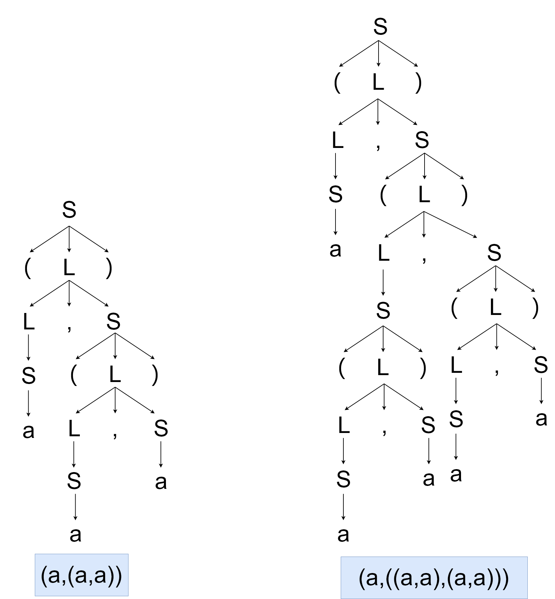

# HW3
PB17111623
范睿
## 3.1 
### a

### b

由a和a组成的允许嵌套的括号

## 3.6

### b

S -> aSbS|bSaS|ε

### c 

S -> U|V

U -> TaU|TaT

V -> TbV|TbT

T -> aTbT|bTaT|ε

## 3.8

### a

S -> (L)|a

L -> SL'

L' -> ,SL'|ε

### b

FIRST(S) = {(,a}

FIRST(L) = {(,a}

FIRST(L') = {__,__,ε}

FOLLOW(S) = FIRST(L') + {$} = {,,),$}

FOLLOW(L) = {),$}

FOLLOW(L') = {),$}

|      |   (    |   a    |   )   |    ,     | $     |
| ---- | :----: | :----: | :---: | :------: | ----- |
| S    | S->(L) |  S->a  |       |          |       |
| L    | L->SL' | L->SL' |       |          |       |
| L'   |        |        | L'->ε | L'->,SL' | L'->ε |

## 3.10

FIRST(D)=FIRST(T)={int,real}

FIRST(L)={id}

FIRST(R)={__,__,ε}

FOLLOW(D)=FOLLOW(L)=FOLLOW(R)={$}

FOLLOW(T)=FIRST(L)={id}

|      | int    | real    | id      | ,         | $    |
| ---- | ------ | ------- | ------- | --------- | ---- |
| D    | D->TL  | D->TL   |         |           |      |
| T    | T->int | T->real |         |           |      |
| L    |        |         | L->id R |           |      |
| R    |        |         |         | R->, id R | R->ε |

## 3.11

FIRST(S) = {a, b, ε}

FIRST(A) = {a, b}

FIRST(B) = {a, b}

FOLLOW(S) = {$}

FOLLOW(A) = {a, b, $}

FOLLOW(B) = {a, b, $}

|      | a        | b        | $      |
| ---- | -------- | -------- | ------ |
| S    | S -> aBS | S -> bAS | S -> ε |
| A    | A -> a   | A -> bAA |        |
| B    | B -> aBB | B -> b   |        |

## 3.12

不是LL(1)文法，因为FIRST(AB)和FIRST(PQx)的交集不为空集，可以找到元素x均在两个集合中。

