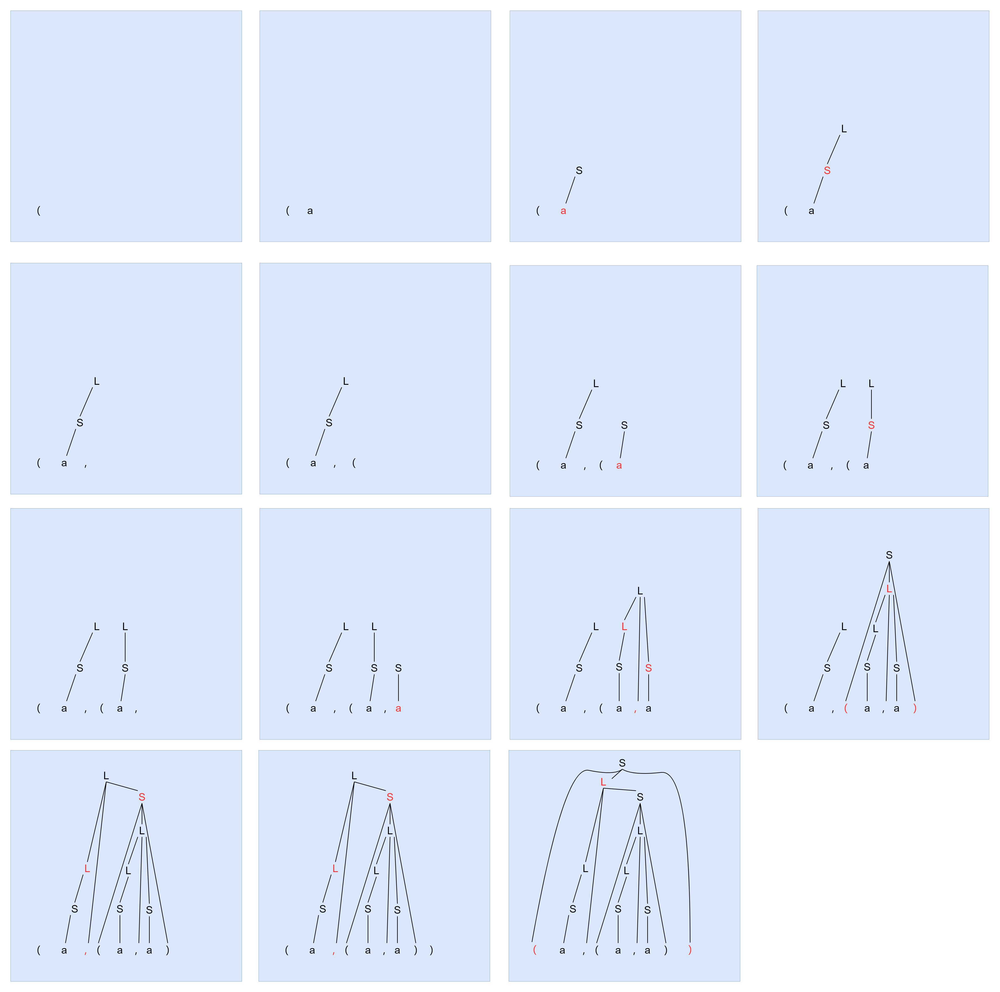
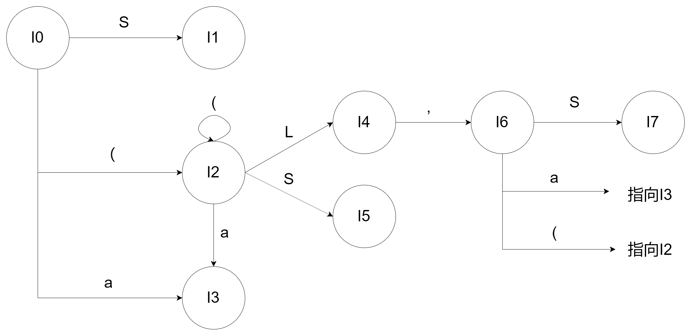

# HW4

PB17111623

范睿

 ## 3.16

### (a)

S => __(L)__ => (__L, S__) => (L, __(L)__) => (L, (__L, S__)) => (L, (L, __a__)) => (L, (__S__, a)) => (L, (__a__, a)) => (__S__, (a, a)) => (__a__, (a, a)) 

### (b)

| 栈         |     输入     |       动作        |
| ---------- | :----------: | :---------------: |
| $          | (a, (a, a))$ |       移进        |
| $(         | a, (a, a))$  |       移进        |
| $(a        |  , (a, a))$  |  按照S -> a归约   |
| $(S        |  , (a, a))$  |  按照L -> S归约   |
| $(L        |  , (a, a))$  |       移进        |
| $(L, (     |   a, a))$    |       移进        |
| $(L, (a    |    , a))$    |  按照S -> a归约   |
| $(L, (S    |    , a))$    |  按照L -> S归约   |
| $(L, (L    |    , a))$    |       移进        |
| $(L, (L,   |     a))$     |       移进        |
| $(L, (L, a |     ))$      |  按照S -> a归约   |
| $(L, (L, S |     ))$      | 按照L ->L, S归约  |
| $(L, (L    |     ))$      |       移进        |
| $(L, (L)   |      )$      |    按照S ->(L)    |
| $(L, S     |      )$      | 按照L ->L, S归约  |
| $(L        |      )$      |       移进        |
| $(L)       |      $       | 按照S -> (L) 归约 |
| $S         |      $       |       接受        |

### (c)

## 3.17

I0: 

​	S' -> ·S

​	S -> ·(L)

​	S -> ·a

I1:

​	S' -> S·

I2:

​	S -> (·L)

​	L -> ·L, S

​	L -> ·S

​	S -> ·(L)

​	S -> ·a

I3:

​	S -> a·

I4:

​	L -> L·, S

I5:

​	L -> S·

I6:

​	L -> L, ·S

​	S -> ·(L)

​	S -> ·a

I7:

​	L -> L, S·

## 3.19 a

(1) E -> E+T

(2) E -> T

(3) T -> TF

(4) T -> F

(5) F -> F*

(6) F -> a

(7) F -> b

|      | +    | *    | a    | b    | $    | E    | T    | F    |
| ---- | ---- | ---- | ---- | ---- | ---- | ---- | ---- | ---- |
| I0   |      |      | s6   | s7   |      | 1    | 2    | 3    |
| I1   | s4   |      |      |      | acc  |      |      |      |
| I2   | r2   |      | s6   | s7   |      |      |      | 5    |
| I3   | r4   | s8   | r4   | r4   | r4   |      |      |      |
| I4   |      |      | s6   | s7   |      |      | 9    | 5    |
| I5   | r3   | s8   | r3   | r3   | r3   |      |      |      |
| I6   | r6   | r6   | r6   | r6   | r6   |      |      |      |
| I7   | r7   | r7   | r7   | r7   | r7   |      |      |      |
| I8   | r5   | r5   | r5   | r5   | r5   |      |      |      |
| I9   | r1   |      | s6   | s7   |      |      |      | 5    |

