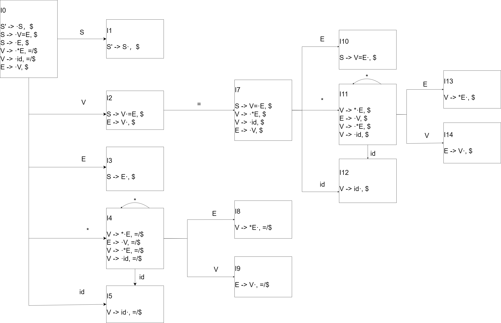

# HW5

PB17111623

范睿

## 3.21

证明是LL(1)文法：

First(A)=∅

Fitst(B)=∅

First(A)∩First(B)=∅

此文法满足LL(1)的两条性质，因此此文法是LL(1)文法。

证明不是SLR(1)文法：

A -> ·ε发生冲突，可以归约也可以转换状态。

B -> ·ε同理。

## 3.25

含有移进-归约冲突的规范LR（1）项目集：

* I0：M -> ·ε，a
* I2：M -> ·ε，a
* I5：M -> ·ε，a

遇到a时，不知是以L->a归约还是以M->ε归约。

## 3.27

### （a）

S为无符号数

I为无符号整数

R为无符号实数

W为无符号实数的小数点前面部分

F为无符号实数小数点后面部分

### （b）

不是。

I -> d与W -> Wd存在冲突。出现d时可以按照前者归约，也可以先把后者的W按照ε归约后和d组合归约成W。

## 3.29

### （a）

(注：无6状态，一共14个状态)

### （b）

有同心项目集。合并没有冲突。

## 3.30

此文法定义的语言为：...a...(若干个)...aba...(若干个)...aba...(若干个)...b...

文法：

S -> aS|aYbS|ε

Y -> aYbY|ε

