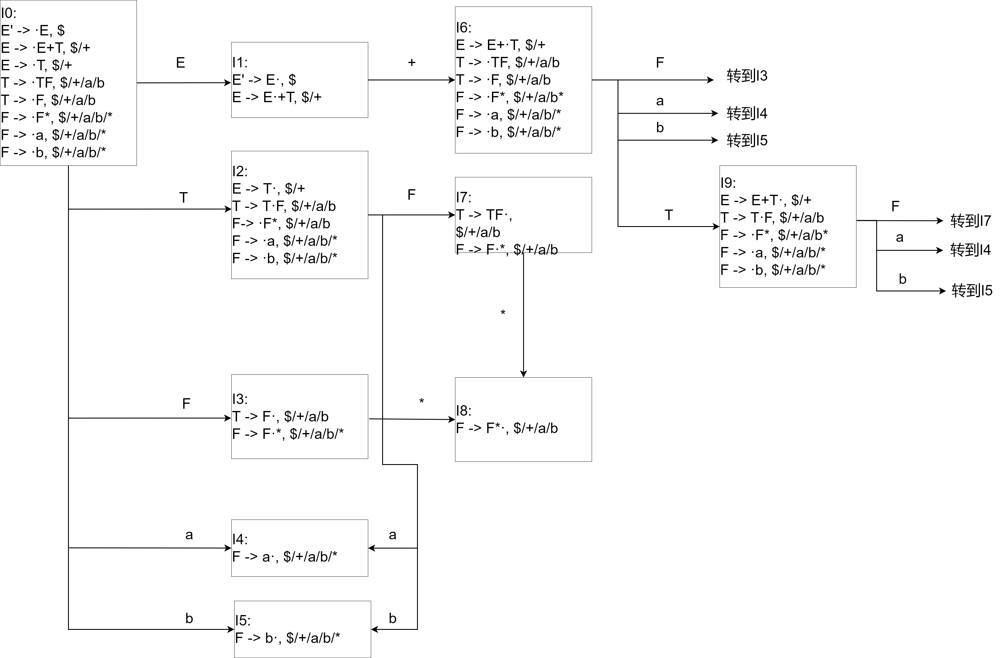
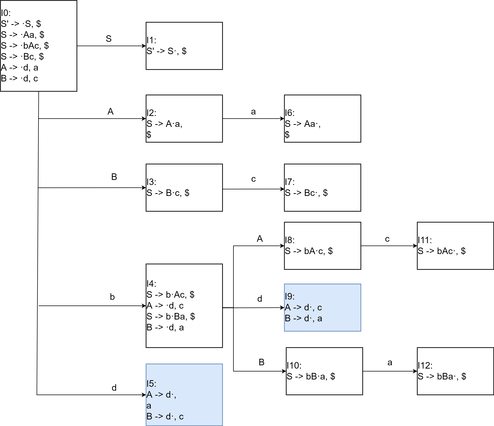
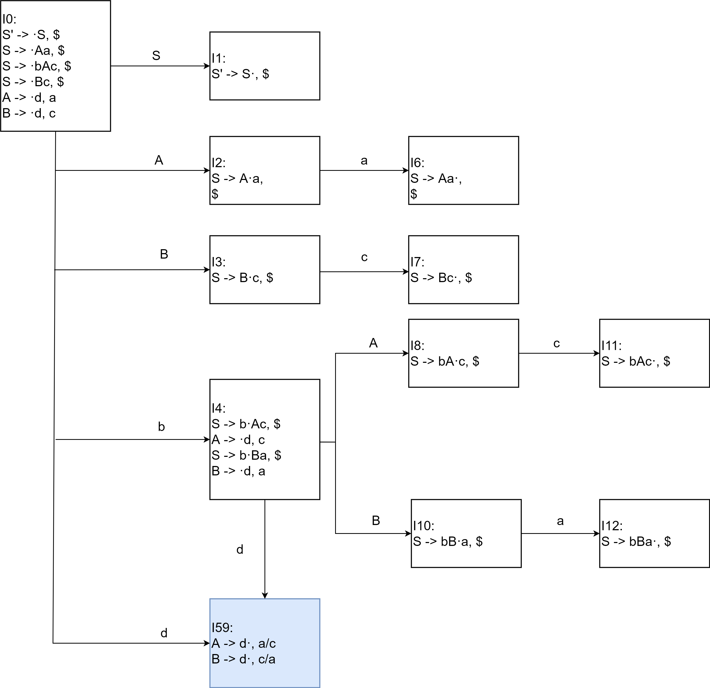
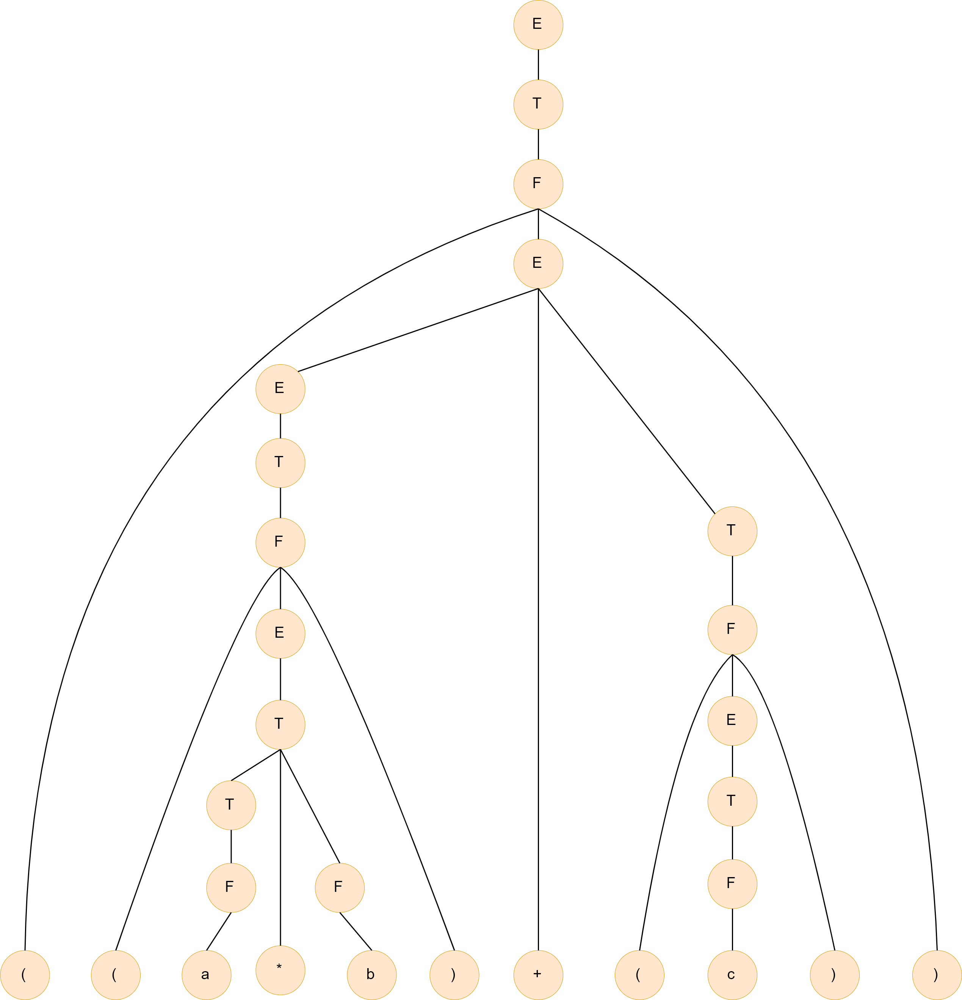
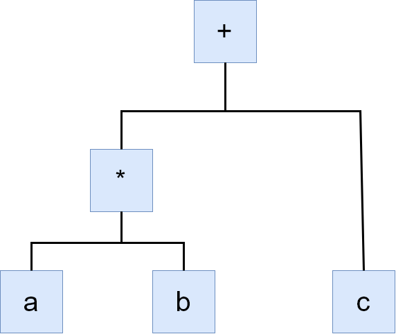

# HW6

PB17111623

范睿

## 3.19b

DFA如下：

分析表如下：

|      | a    | b    | +    | *    | $    | E    | T    | F    |
| ---- | ---- | ---- | ---- | ---- | ---- | ---- | ---- | ---- |
| 0    | s4   | s5   |      |      |      | 1    | 2    | 3    |
| 1    |      |      | s6   |      | acc  |      |      |      |
| 2    | s4   | s5   | r2   |      | r2   |      |      | 7    |
| 3    | r4   | r4   | r4   | s8   | r4   |      |      |      |
| 4    | r6   | r6   | r6   | r6   | r6   |      |      |      |
| 5    | r7   | r7   | r7   | r7   | r7   |      |      |      |
| 6    | s4   | s5   |      |      |      |      | 9    | 3    |
| 7    | r3   | r3   | r3   | s8   | r3   |      |      |      |
| 8    | r5   | r5   | r5   |      | r5   |      |      |      |
| 9    | s4   | s5   | r1   |      | r1   |      |      | 7    |

## 3.24

该文法的LR(1)的DFA如下图所示。

得到LR(1)分析表如下

|      | a    | b    | c    | d    | $    | A    | B    | S    |
| ---- | ---- | ---- | ---- | ---- | ---- | ---- | ---- | ---- |
| 0    |      | s4   |      | s5   |      | 2    | 3    | 1    |
| 1    |      |      |      |      | acc  |      |      |      |
| 2    | s6   |      |      |      |      |      |      |      |
| 3    |      |      | s7   |      |      |      |      |      |
| 4    |      |      |      | s9   |      | 8    | 10   |      |
| 5    | r5   |      | r6   |      |      |      |      |      |
| 6    |      |      |      |      | r1   |      |      |      |
| 7    |      |      |      |      | r3   |      |      |      |
| 8    |      |      | s11  |      |      |      |      |      |
| 9    | r6   |      | r5   |      |      |      |      |      |
| 10   | s12  |      |      |      |      |      |      |      |
| 11   |      |      |      |      | r2   |      |      |      |
| 12   |      |      |      |      | r4   |      |      |      |

可以发现，两个蓝色的的状态为同心项目集，将它们合并后，DFA如下：

LALR分析表如下

|      | a     | b    | c     | d    | $    | A    | B    | S    |
| ---- | ----- | ---- | ----- | ---- | ---- | ---- | ---- | ---- |
| 0    |       | s4   |       | s59  |      | 2    | 3    | 1    |
| 1    |       |      |       |      | acc  |      |      |      |
| 2    | s6    |      |       |      |      |      |      |      |
| 3    |       |      | s7    |      |      |      |      |      |
| 4    |       |      |       | s59  |      | 8    | 10   |      |
| 59   | r5/r6 |      | r6/r5 |      |      |      |      |      |
| 6    |       |      |       |      | r1   |      |      |      |
| 7    |       |      |       |      | r3   |      |      |      |
| 8    |       |      | s11   |      |      |      |      |      |
| 10   | s12   |      |       |      |      |      |      |      |
| 11   |       |      |       |      | r2   |      |      |      |
| 12   |       |      |       |      | r4   |      |      |      |

发现，合并后的状态I59发生归约-归约冲突。

## 4.2 a

分析树

语法树

## 4.3

### a

| 产生式     | 语义规则               |
| ---------- | ---------------------- |
| S -> (L)   | S.val = L.val+1        |
| S -> a     | S.val = 0              |
| L -> L1, S | L.val = L1.val + S.val |
| L -> S     | L.val = S.val          |

### b

| 产生式     | 语义规则                  |
| ---------- | ------------------------- |
| S -> (L)   | S.val = L.val+1           |
| S -> a     | S.val = 0                 |
| L -> L1, S | L.val = max(L.val, S.val) |
| L -> S     | L.val = S.val             |

## 4.5

| 产生式              | 语义规则              |
| ------------------- | --------------------- |
| S -> E              | S.val=E.val           |
| E -> while E1 do E2 | E.val=E1.val+E2.val+1 |
| E -> id:=E1         | E.val=E1.val          |
| E -> E1+E2          | E.val=E1.val+E2.val   |
| E -> id             | E.val=0               |
| E -> (E1)           | E.val=E1.val          |

## 例3

| 产生式   | 语义规则                                                     |
| -------- | ------------------------------------------------------------ |
| S -> L.R | S.syn = L.syn+R.syn R.inh = -1                          |
| S -> L   | S.syn = L.syn                                                |
| L -> L1B | L.syn = L1.syn*2+B.syn                                       |
| L -> B   | L.syn = B.syn                                                |
| R -> BR1 | R.syn = B.syn*2^B.inh+R1.syn B.inh = R.inh R1.inh = R.inh-1 |
| R -> B   | R.syn = B.syn*2^B.inh B.inh = R.inh                     |
| B -> 0   | B.syn=0                                                      |
| B -> 1   | B.syn=1                                                      |

