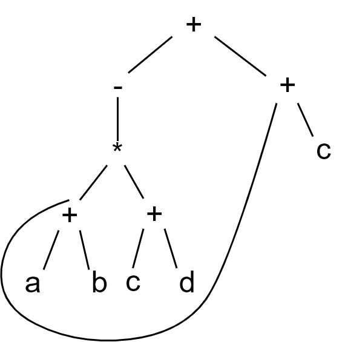

# HW8

## 7.1

### b



## d

t1 = a + b

t2 = -t1

t3 = c+d

t4 = t2 + t3

t5 = t1 + c

t6 = t4 + t5

## ppt

```c
if(a > 5 and b < 3) then
	i = 0;
	while(i <= 100)
	i = i + 1;
else
	x = x + 5;
```


```
	if a>5 goto L1
	goto ELSE
L1:
	if b<3 goto IF
	goto ELSE
IF:
    i = 0
LOOP:
	if i <= 100 WHILE
	goto OUT
WHILE:
    t1 = i + 1
    i = t1
    goto LOOP
ELSE:
	t2 = x + 5
	x = t2
OUT:
```

