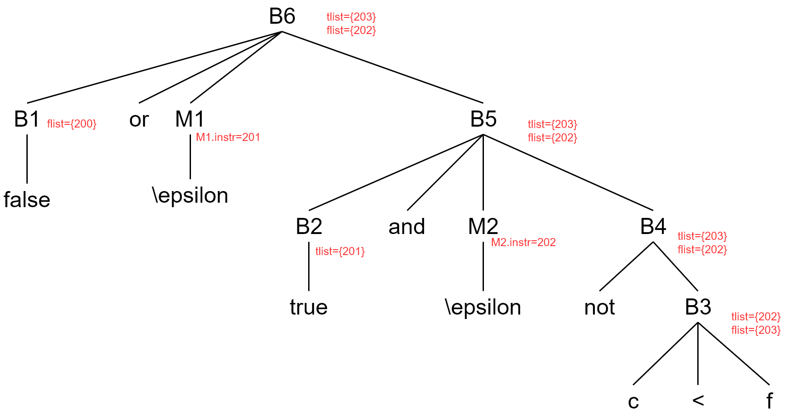

# HW9

false or true and not c < f 

## 生成对应的三地址代码 

| 地址号 | 三地址代码              |
| ------ | ----------------------- |
| (200)  | goto 201                |
| (201)  | goto 202                |
| (202)  | if c<f goto (false出口) |
| (203)  | goto (true出口)         |

## 注释分析树 

* 利用B5 -> B2 and M2 B4归约时，利用M2.instr=202回填了B2.tlist
* 利用B5 -> B1 or M1 B5归约时，利用M1.instr=201回填了B1.flist 